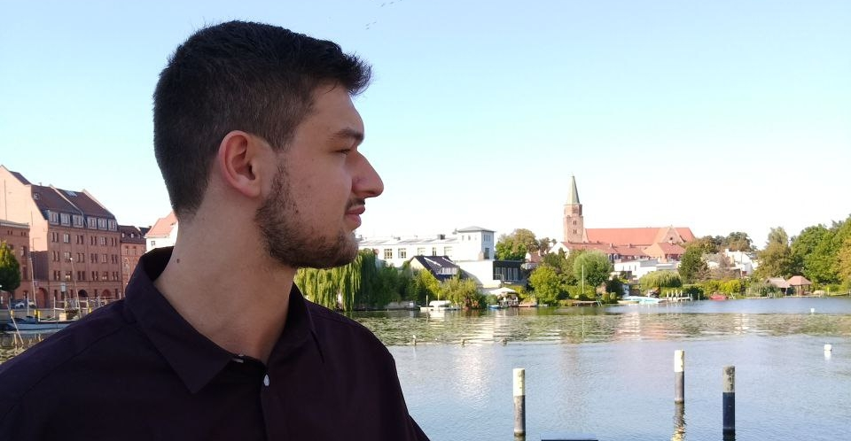

Ich bin leidenschaftlicher Open Source Enthusiast und interessiere mich Systeme, Netzwerke und Programme 
sicher zu gestalten sowie, diese auf ihre Sicherheit zu prüfen. 
Mein Ziel ist es, mich immer weiter zu entwickeln und stets zu verbessern 🧠🏋️.

- 🔭 Zurzeit studiere ich Informatik an der Technischen Hochschle in Brandenburg.
- 🌱 Im Moment suche ich ständig technische Herausforderungen.
- 👯 Ich treffe mich mit Freunden im [Chaostreff Potsdam](https://www.ccc-p.org/) 🚀 und in der [Brandenburger Linux User Group](https://www.bralug.de/) 🐧.
- ⚡ Fun fact: Ich liebe schwimmen 🏊‍♂️.
- 📚 Mein Blog: [Hackwiki](https://www.hackwiki.de/)

