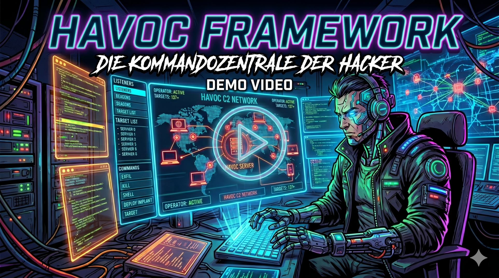
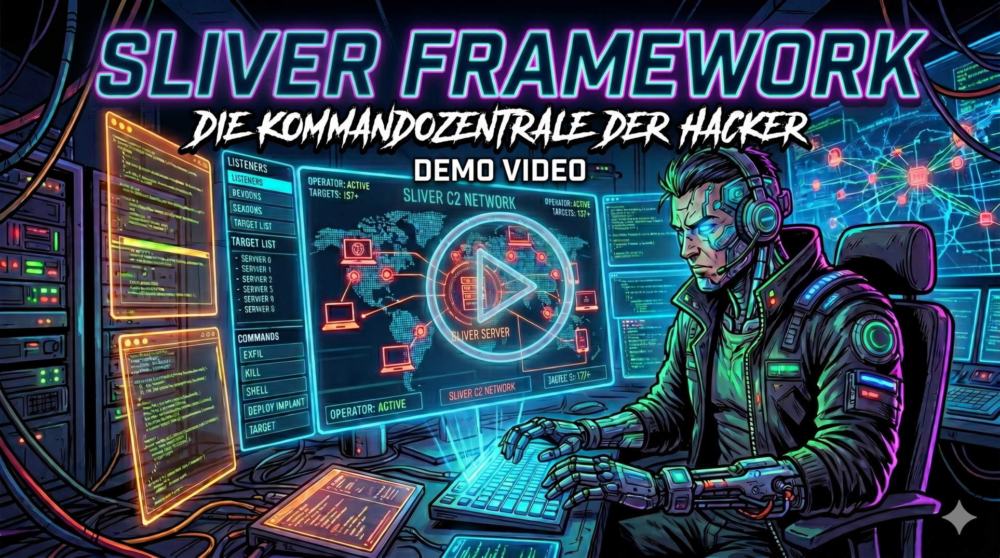
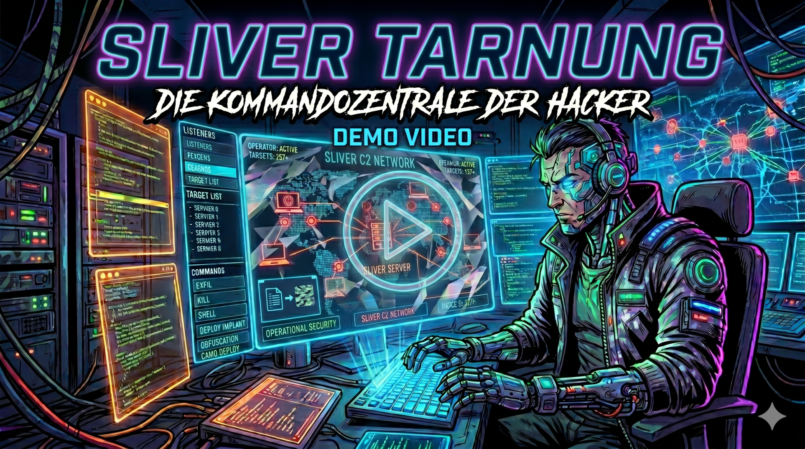


Disclaimer vorab: Dieser Post handelt von Hacking-Tools und Techniken, die ausschließlich für Bildungszwecke, Schulungen und legale Penetrationstests bestimmt sind. Sie sollen aufzeigen, wie Angreifer vorgehen und wie man sich davor schützen kann.


Hallo zusammen! Kürzlich habe ich einen Vortrag zum Thema **"C2-Frameworks: Command & Control in der Netzwerksicherheit"** gehalten. Im folgendem fasse ich die wichtigsten Kernpunkte meiner Präsentation hier auf dem Blog zusammen.

### Was sind C2-Frameworks und warum sind sie wichtig?
Wenn wir uns die klassische "Cyber Kill Chain" ansehen, ist Command & Control (C2) der entscheidende Schritt, der einem Angreifer "Hands-on-Keyboard"-Zugriff auf ein Zielnetzwerk gibt. Aus der Perspektive eines Red Teams (oder echter Angreifer) haben C2-Frameworks klare Ziele:
* **Zentrale Kontrolle:** Verwaltung tausender kompromittierter Systeme über ein Interface.
* **Operationssicherheit (OPSEC):** Zuverlässige und vor allem verdeckte Kommunikation.
* **Persistenz:** Das Aufrechterhalten des Zugriffs, selbst wenn Blue Teams Gegenmaßnahmen ergreifen.

Wie real und zerstörerisch solche Infrastrukturen sein können, zeigt die jüngste **Operation Phantom**. Bei diesem Angriff der nordkoreanischen Lazarus Gruppe auf Krypto-Entwicklerteams wurden komplexe Netzwerke aus Proxy-Servern und spezialisierten C2-Servern genutzt, um einen weltweiten Supply-Chain-Angriff durchzuführen.

### Von IRC zu "In-Memory" Ausführung
Es ist faszinierend, die Evolution dieser Tools zu betrachten.
In den späten 90ern lief die Kommunikation noch als Klartext über öffentliche IRC-Server.
Heute nutzen moderne Frameworks legitime Cloud-Dienste zur Tarnung.

Ein echter Gamechanger sind dabei **Beacon Object Files (BOFs)**. Anstatt verräterische `.exe` oder `.dll` Dateien auf der Festplatte des Opfers abzulegen, werden BOFs zur Laufzeit direkt in den Speicher des Beacon-Prozesses geladen.
Das macht sie ideal und extrem OPSEC-freundlich für Post-Exploitation-Aufgaben wie Host-Enumeration oder das Auslesen von Routing-Tabellen.

### Die Werkzeuge der Profis
In meinem Vortrag habe ich verschiedene Frameworks genauer beleuchtet und in Live-Demos gezeigt:
* **Cobalt Strike:** Der kommerzielle "Goldstandard", der sowohl von Red Teams als auch von echten Advanced Persistent Threats (APTs) genutzt wird[cite: 294, 307].
* **Empire:** Ein bekanntes Open-Source Framework (PowerShell-basiert) mit dem schicken WebUI-Client *Starkiller*.
* **Havoc:** Ein modernes Framework mit Go-Server und C++ GUI-Client, das natürlich auch BOFs (COFF Loader) unterstützt.
* **Sliver:** Eine in Golang entwickelte, extrem beliebte Alternative zu Cobalt Strike, die besonders durch starke Multiplayer-Fähigkeiten und CLI-Fokus glänzt.

### Tarnung ist alles
Zum Abschluss haben wir uns angesehen, wie Frameworks wie Sliver ihre Kommunikation in der Masse verstecken. Angreifer nutzen realistische URL-Strukturen (z.B. `/api/v1/status`), legitime HTTP-Header und unregelmäßige Timings, sodass der C2-Traffic für Verteidiger exakt wie gewöhnliches Web-Browsing aussieht.

### Präsentationsfolien zum Vortrag:

* [Präsentation C2-Frameworks](data/C2-Frameworks.pdf)

### Demo Videos

Für den Vortrag habe ich verschiedene Demos vorbereitet, diese sind jedoch ohne Kommentar.
Da ich sie im Vortrag live kommentiert habe, ich möchte sie denoch nicht vorenthalten.
Sie geben einen guten Einblick in die Funktionsweise und die Bedienung der Frameworks.

Das erste Video zeigt wie man mit Empire die Verbindung zu einem Zielsystem aufbaut (4min):

Das zweite Video zeigt wie man mit Havoc die Verbindung zu einem Zielsystem aufbaut (3min):

Das dritte Video zeigt wie man mit Sliver die Verbindung zu einem Zielsystem aufbaut (2min):

Das vierte Video zeigt wie Sliver im HTTP-Modus getarnt kommuniziert (1min):

Wenn ihr noch Fragen habt oder über die Themen diskutieren wollt, meldet euch gerne per Mail bei mir.
