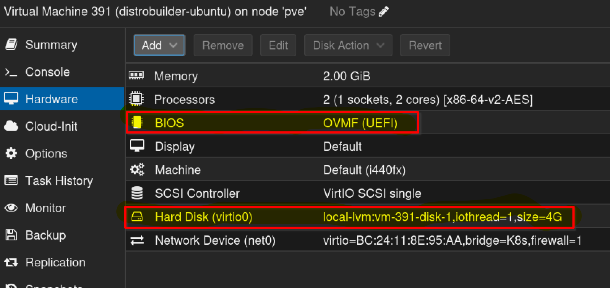
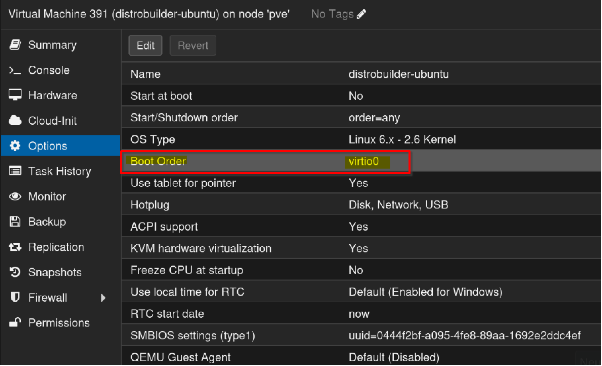
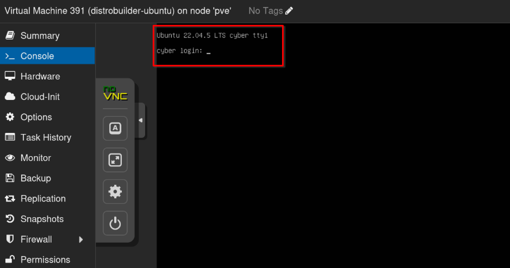

Hast du dich jemals gefragt, wie man eigene Images für LXC erstellt und diese dann in Proxmox integriert?
Obwohl ich bereits einige Zeit mit LXC gearbeitet habe, bin ich nie wirklich dazu gekommen, mein eigenes Image zu erstellen.
Neugierig geworden, begab ich mich auf die Suche und stieß auf [Distrobuilder](https://github.com/lxc/distrobuilder) – ein Tool zum Erstellen von Images für LXC und LXD, das in Golang geschrieben ist. Es bietet auch die Möglichkeit VM zu erstellen, dies habe ich gleich mitprobiert.

## Installation ✨
Die Dokumentation zur Installation ist recht ausführlich, daher werde ich hier nicht weiter darauf eingehen.
Beachte nur, dass mindestens Golang 1.21 erforderlich ist.
Ich hatte zunächst Probleme, da meine Golang-Version noch auf 1.20 war.

## Templates 🧩
Als Nächstes holte ich mir die Vorlagen aus dem [Template-Verzeichnis](https://github.com/lxc/lxc-ci).
Besonders interessierte mich das OpenWrt-Template.

## Image erstellen 🔨

Im Template-Verzeichnis führte ich dann den folgenden Befehl aus:


distrobuilder build-lxc images/openwrt.yaml -o image.variant=default -o image.release=23.05 


Dieser Befehl erstellt die Dateien: `rootfs.tar.xz` und `metadata.tar.xz`. Das `rootfs.tar.xz` kann dann mit `scp` oder `rsync` auf den Proxmox-Server kopiert werden.

Es hat eine Weile gedauert, bis ich verstand, dass das `rootfs.tar.xz` ausreicht, um einen Container zu erstellen.
Ich war der Meinung, dass ich noch daraus ein Image erstellen müsste. Aber das ist nicht der Fall. 
Proxmox bietet die Möglichkeit, einen Container direkt aus einem `rootfs.tar.xz` zu erstellen.

Mit folgendem Befehl erstellte ich den Container:

pct create 107 ./rootfs.tar.xz --unprivileged 1 --ostype unmanaged --hostname openwrt -net0 name=eth0 -net1 name=eth1 --storage local-lvm


Nach einigen Einstellungen an den Netzwerkschnittstellen und der Container war einsatzbereit und konnte gestartet werden.

## VM erstellen 🔨
Bevor mit der erstellung von VM begonnen werden kann müssen Debian noch die Pakete `btrfs-progs` und `qemu-utils` installiert werde:


apt install btrfs-progs qemu-utils


Im Template-Verzeichnis führte ich dann den folgenden Befehl aus:

### Ubuntu VM erstellen

sudo /home/rar/go/bin/distrobuilder build-incus --vm ubuntu.yaml -o image.release=jammy 


Dieses Befehl erstellt die Dateien: `disk.qcow2` und `incus.tar.xz`.
Die Datei `disk.qcow2` kann dann mit `scp` oder `rsync` auf den Proxmox-Server kopiert werden.


qm create 390
qm importdisk 390 ubuntu.qcow2 local-lvm -format qcow2


Wichtig ist es die Festplatte im System hinzuzufügen (`Harware` -> `Edit` -> `Add`) und UEFI zu verwenden:

Weiterhin muss die Bootreinfolge in `Options` gesetzt werden:

Danach stertet die VM wie gewollt:

### OpenWrt VM erstellen 

Mit folgenden Befehl lässt sich ein OpenWrt VM erstellen:

distrobuilder build-incus --vm images/openwrt.yaml -o image.release=23.05


Leider gibt es ein [Problem](https://github.com/lxc/distrobuilder/issues/880) bei der EFI Partition in ditrobuilder.

## Fazit 🏁

Insgesamt finde ich Distrobuilder ein ausgezeichnetes Tool zur Erstellung von Images für LXC.
Es ist einfach zu bedienen und hat mir ermöglicht,
schnell und unkompliziert mein eigenes OpenWrt-Image
zu erstellen und in Proxmox zu integrieren.
