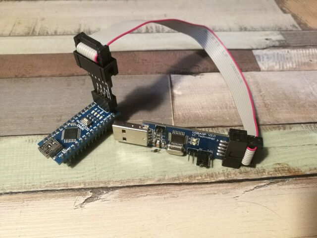
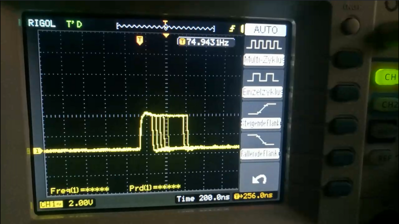
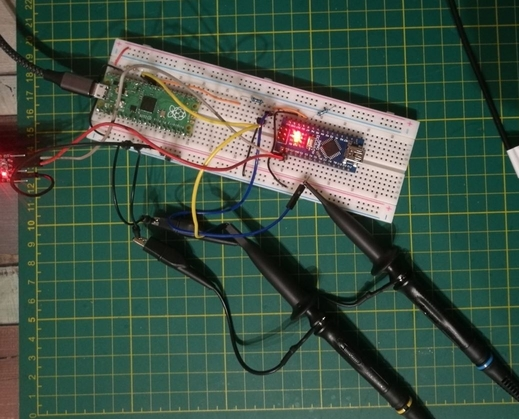
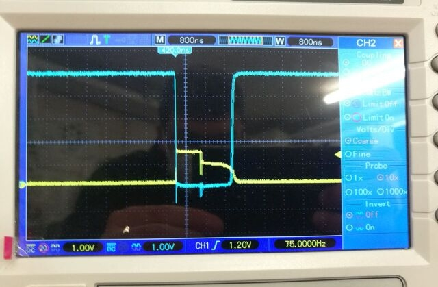
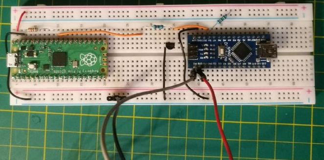
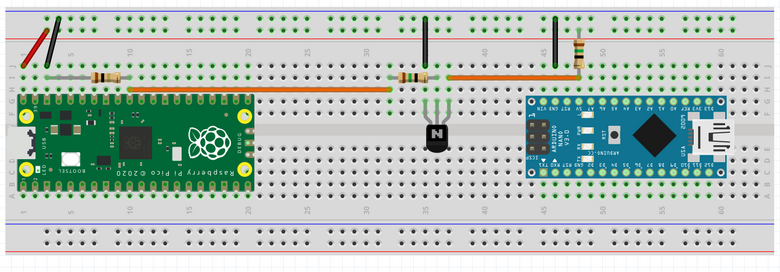
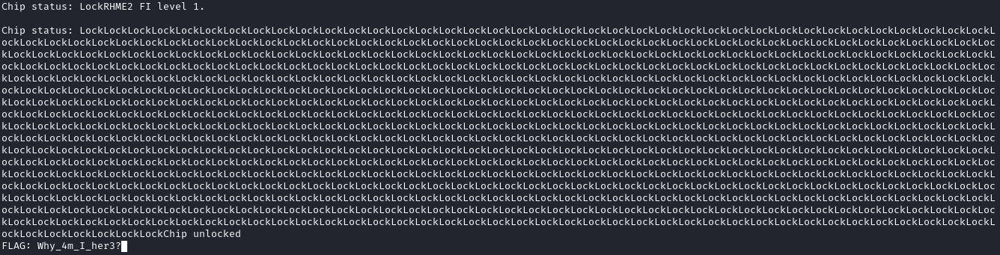
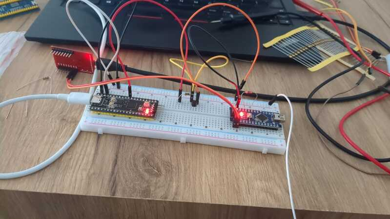
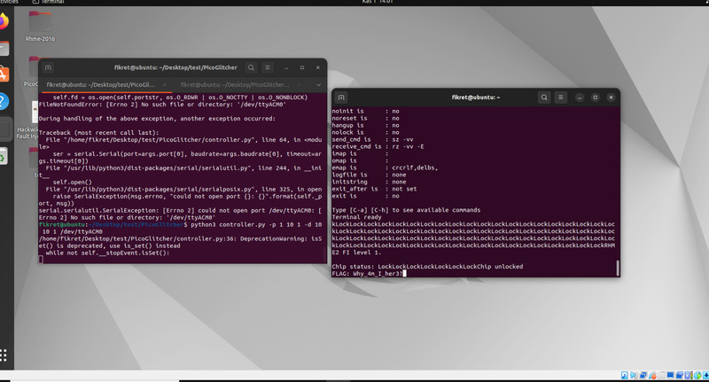

Some time ago, I solved the "Photo Manager" task from the RHME2 (2016) CTF. [Link Github Gist](https://gist.github.com/53845714nF/7ad4c6eb0c38aae9a725e54859f1b8f2)

Now, I wanted to try something with more hardware involvement.

## My Inspiration 🤔

 | 

The first video is from LiveOverflow. It shows how to perform a fault injection on the "Fiesta" challenge from the RHME2 CTF using an FPGA board. The second one is from Stacksmashing, where he demonstrates performing fault injection on an Apple AirTag using a Raspberry Pico to access the tag's firmware.

I had the idea of combining both approaches, pitting the Raspberry Pico against the Arduino Nano. ⚔️

## Brief Theory 👨‍🏫
The basic idea is to momentarily deprive the CPU of power and hope that it miscalculates or skips individual instructions during that time.

## Setting Up the Target System 🎯
The target is an Arduino Nano. The heart of it is the ATmega328 microcontroller, the same chip used in the Arduino Uno and now used in hundreds of projects.

For the CTF, the hex files are flashed directly onto the Arduino using the following command:

`avrdude -c arduino -p atmega328p -P /dev/ttyUSB* -b115200 -u -V -U flash:w:CHALLENGE.hex`

Unfortunately, this didn't work for me with the built-in USB port. So, I used the ISP interfaces. To communicate with them, I used a USBasp.

To use this, you need to make the following change in the operating system:

`vim /etc/udev/rules.d/60-objdev.rules`

Then, insert the following content:


SUBSYSTEM=="usb", ENV{DEVTYPE}=="usb_device", SYSFS{idVendor}=="16c0", SYSFS{idProduct}=="05dc", MODE="0666"


Then, run the following:

`sudo /etc/init.d/udev restart` or restart the computer.

This is necessary so that the operating system recognizes the USB stick and we can interact with it.

You can now flash the hex file with the following command:

`avrdude -c usbasp -p atmega328p -P usb -b115200 -u -V -U flash:w:fiesta.hex`

Now, the Arduino can be connected to the computer via USB. With the following command, we can see what it outputs:

`screen /dev/ttyUSB0 19200`

This is a standard communication over [UART](https://en.wikipedia.org/wiki/Universal_asynchronous_receiver-transmitter).

You'll be greeted with the following text:


RHME2 FI level 1.

Chip status: LockLockLockLockLockLockLockLockLockLockLockLockLockLockLockLockLockLockLockLockLockLockLockLockLockLockLockLockLockLockLockLockLockLockLockLockLockLockLockLockLockLockLockLockLockLockLockLockLockLockLockLockLockLockLockLockLockLockLockLo
ckLockLockLockLockLockLockLockLockLockLockLockLockLockLockLockLockLockLockLockLockLockLockLockLockLockLockLockLockLockLockLockLockLockLockLockLockLockLockLockLockLockLockLockLockLockLockLockLockLockLockLockLockLockLockLockLockLockLockLockLockLockL
ockLockLockLockLockLockLockLockLockLockLockLockLockLockLockLockLockLockLockLockLockLockLockLockLock


One can roughly imagine what code is being executed here:



Serial.println("RHME2 FI level 1.");
Serial.print("Chip status:");

while(true) {
  Serial.print("Lock");
}

Serial.print("FLAG");



That's roughly what's happening in my head. A programmer would see that we're stuck in an infinite loop due to the `while(true)` and can't exit it. However, since the CTF always mentions fault injection, it means that we have to glitch at this point. I believe the CTF developers have incorporated some mechanisms to make glitching easier since this is a beginner-level challenge.

## Setting Up the Attacker System 🏹
I initially wanted to try programming the Pico myself, but I came across this blog: [Deralchemist Blog](https://deralchemist.wordpress.com/2021/05/28/raspberry-pico-voltage-glitcher)

Apparently, someone had the same idea as me and also released their software on [Github](https://github.com/MKesenheimer/PicoGlitcher). It consists of firmware for the Pico and a Python script to control the pulse.

### Firmware
Here is a brief description of how to build the firmware and transfer it to the Pico:

I recommend watching this [video](https://www.youtube.com/watch?v=JhajoAyP8e4) before you start. It's from Low Level Learning, and it gives a brief overview of how to program the Pico with C++.

For us, it means cloning the repo:

`git clone https://github.com/MKesenheimer/PicoGlitcher.git`

Create a `build` folder, then `cmake ..`, and then `make`.

I had a small issue with the Pico SDK. I had to navigate to the pico-sdk directory once:

`cd /home/rar/Documents/pico/pico-sdk`

and then run:

`git submodule update --init`

After that, there were no more errors during compilation. In the end, you'll get a `.uf2` file.

You can copy this `.uf2` file to the Pico, which appears as a storage drive on your computer.

Here's an initial test on the Pico's pin:

In the video, you can see the voltage briefly increasing, which is exactly what you're trying to achieve. This is controlled by the Python script:

`./controller.py /dev/ttyACM0 --timeout 0.01 -p 10 10 1 -d 10 15 1`

## Connecting the Two Microcontrollers 👫
This was probably the most challenging part for me. Fortunately, I received help from the [Potsdammer Chaostreff](https://www.ccc-p.org/).

Thanks to [Christoph](https://github.com/chsterz) for providing me with one of his transistors. And a big thanks to [tz](https://github.com/123TzTz321), who helped me a lot with assembling and measuring the transistors.

We used a `BC547C` NPN bipolar transistor. During the setup, we had to do a lot of measurements, here are some pictures:

 | 

The left image shows the two measurement probes of our experiment. The yellow cable is connected to the Pico's pin where the pulse is measured. The blue jumper goes to the transistor's output. In the right image, you can see that the yellow graph goes up, which means the transistor is switching. The blue graph briefly goes to ground.

Here's the complete setup again:

(On the left side, there's a 1KΩ resistor, and the other two are 15Ω)

In reality:

On the computer:

**Note 1: The orange cable from the transistor should not remain connected to the 5V pin of the Arduino for too long.**

Since the Arduino will restart, and the glitch will be repeated, it could damage the firmware.

**Note 2: An external USB-UART converter is used.**

The power line is not used because it might provide too much power to the Arduino Nano.

## The Result 🎉
Oh, and the most important part... the flag 🚩

## Reader's Comments 📝
I was pleased to receive feedback from [Fikret Garipay](https://www.linkedin.com/in/fikretgaripay).

He recreated the experiment and had the following comments:

He used GPIO26 on the Pico as the glitch output. He connected the glitch output to the base of a `BC548` transistor (very similar to `BC547C`) using a 47Ω resistor. He connected the emitter to ground and the collector to the 5V input. When using the Pico's 5V input, he also used a 47Ω resistor.

He also used different software, PicoGlitcher by kholia (No longer available), which was a fork of the tool I used.

He started the software with the following command:

With this setup, he successfully obtained the flag. 🚩
