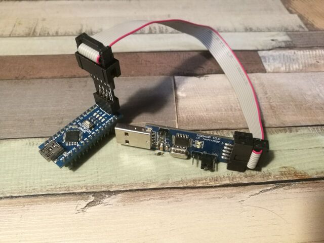
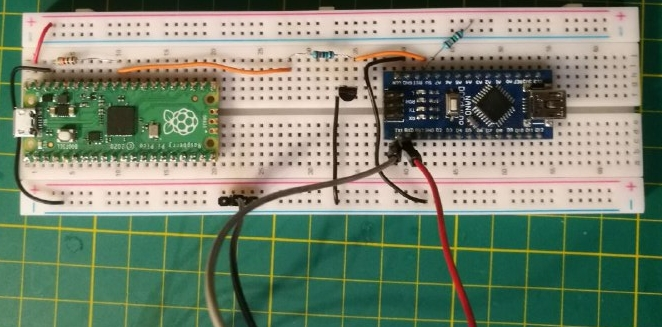
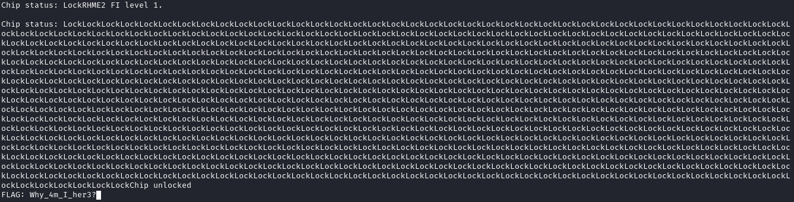
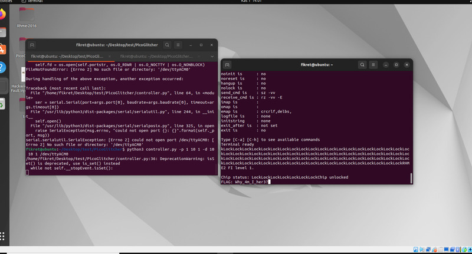

Vor einiger Zeit habe ich schon einmal die Aufgabe "Photo Manager" vom RHME2 (2016) CTF gelöst. [Link Github Gist](https://gist.github.com/53845714nF/7ad4c6eb0c38aae9a725e54859f1b8f2)

Nun wollte ich mich mal an etwas mit mehr Hardwarebezug wagen.

## Meine Inspiration 🤔

 | 

Das erste Video stammt von LiveOverflow. Er zeigt, wie man mit Hilfe eines FPGA Boards eine Fault Injection auf das Challenge "Fiesta" vom RHME2 CTF durchführt. Das zweite stammt von Stacksmashing. Hier zeigt er, wie er mit Hilfe eines Raspberry Pico eine Fault Injection auf ein Apple AirTag durchführt, um an die Firmware des Tags zu gelangen.

In mir kam die Idee auf, man könnte ja beides verbinden, also den Raspberry Pico gegen den Arduino Nano antreten lassen. ⚔️

## Kurze Theorie 👨‍🏫
Die Grundidee ist es, der CPU für wenige Augenblicke den Strom zu entziehen und zu hoffen, dass sie sich während dieser Zeit verrechnet bzw. dass sie einzelne Instruktionen überspringt.

## Aufsetzen des Zielsystem 🎯
Das Ziel ist ein Arduino Nano. Das Herzstück ist der Mikrocontroller ATmega328, derselbe Chip, der auch auf dem Arduino Uno verwendet wurde und mittlerweile in Hunderten von Projekten Verwendung findet.

Für das CTF werden die Hex-Dateien direkt auf den Arduino geflasht mit folgendem Befehl:

`avrdude -c arduino -p atmega328p -P /dev/ttyUSB* -b115200 -u -V -U flash:w:CHALLENGE.hex`

Leider funktionierte das bei mir nicht auf Anhieb mit dem eingebauten USB-Port. Ich habe dann die ISP-Schnittstellen verwendet. Um damit zu kommunizieren, habe ich einen USBasp benutzt.

Um diesen zu verwenden, muss die folgende Änderung im Betriebssystem vorgenommen werden:

`vim /etc/udev/rules.d/60-objdev.rules`

Fügen Sie dann den folgenden Inhalt ein:


SUBSYSTEM=="usb", ENV{DEVTYPE}=="usb_device", SYSFS{idVendor}=="16c0", SYSFS{idProduct}=="05dc", MODE="0666"


Führen Sie dann Folgendes aus:

`sudo /etc/init.d/udev restart` oder den Rechner Neustarten.

Dies ist notwendig, damit das Betriebssystem den USB-Stick erkennt und wir mit ihm interagieren können.
Man kann nun das Hex File mit folgenden Befehl flashen:

`avrdude -c usbasp -p atmega328p -P usb -b115200 -u -V -U flash:w:fiesta.hex`

Nun kann der Arduino über USB mit dem Rechner verbunden werden. Mit folgendem Befehl können wir sehen, was er ausgibt:

`screen /dev/ttyUSB0 19200`

Das ist eine ganz normale Kommunikation über [UART](https://en.wikipedia.org/wiki/Universal_asynchronous_receiver-transmitter).

Uns begrüßt nun folgender Text:


RHME2 FI level 1.

Chip status: LockLockLockLockLockLockLockLockLockLockLockLockLockLockLockLockLockLockLockLockLockLockLockLockLockLockLockLockLockLockLockLockLockLockLockLockLockLockLockLockLockLockLockLockLockLockLockLockLockLockLockLockLockLockLockLo
ckLockLockLockLockLockLockLockLockLockLockLockLockLockLockLockLockLockLockLockLockLockLockLockLockLockLockLockLockLockLockLockLockLockLockLockLockLockLockLockLockLockLockLockLockLockLockLockLockLockLockLockLockLockLockLockLockLockLockL
ockLockLockLockLockLockLockLockLockLockLockLockLockLockLockLockLockLockLockLockLockLockLockLockLock


Man kann sich grob vorstellen, was für ein Code hier ausgeführt wird:



Serial.println("RHME2 FI level 1.");
Serial.print("Chip status:");

while(true) {
  Serial.print("Lock");
}

Serial.print("FLAG");



Das geht so ungefähr in meinem Kopf vor. Ein Programmierer würde sehen, dass wir durch das `while(true)` in einer Endlosschleife stecken und diese nicht verlassen können. Da in dem CTF jedoch immer von Fault Injection die Rede ist, heißt es, dass wir an dieser Stelle glitchen müssen. Ich denke, die Entwickler des CTFs haben noch einige Mechanismen verwendet, die das Glitchen erleichtern, da es eine einfache Challenge ist.

## Aufsetzen des Angreifersystem 🏹
Eigentlich wollte ich mich selbst einmal daran versuchen, den Pico zu programmieren. Aber durch ein wenig Recherche bin ich auf folgenden Blog gestoßen: [Deralchemist Blog](https://deralchemist.wordpress.com/2021/05/28/raspberry-pico-voltage-glitcher/)

Anscheinend hatte jemand bereits die gleiche Idee wie ich und er hat seine Software auch auf [Github](https://github.com/MKesenheimer/PicoGlitcher) veröffentlicht. Sie besteht aus einer Firmware für den Pico und einem Python-Skript, mit dem der Puls gesteuert werden kann.

### Firmware
Hier ist kurz beschrieben, wie man die Firmware erstellt und auf den Pico überträgt:

Ich empfehle, bevor man selbst loslegt, sich folgendes [Video](https://www.youtube.com/watch?v=JhajoAyP8e4) anzusehen. Es stammt von Low Level Learning, und er gibt einen kurzen Überblick darüber, wie der Pico mit C++ programmiert werden kann.

Für uns heißt es, das Repo zu klonen:

`git clone https://github.com/MKesenheimer/PicoGlitcher.git`

Ein `build` Ordner erstellen dann `cmake ..` und dann `make` .

Ich hatte ein kleines Problem mit dem Pico SDK. Ich musste einmal ins pico-sdk Verzeichnis wechseln:

`cd /home/rar/Dokumente/pico/pico-sdk`

und dann Folgendes ausführen:

`git submodule update --init`

Danach gab es beim Kompilieren auch keine Fehler mehr. Am Ende entsteht eine `.uf2` Datei.

Diese `.uf2` Datei kann dann auf den Pico kopiert werden, der sich als Speicherlaufwerk am Computer anhängt.

Hier ist ein erster Test am Pin des Picos:

Im Video ist zu sehen, wie die Spannung einen kurzen Moment ansteigt, genau das, was erreicht werden soll. Das wird über das Python-Skript gesteuert:

`./controller.py /dev/ttyACM0 --timeout 0.01 -p 10 10 1 -d 10 15 1`

## Verbindung der beiden Mikrocontroller 👫
Der für mich wahrscheinlich schwierigste Part. Zu Glück hatte ich hier Hilfe aus dem 
Das war wahrscheinlich der schwierigste Teil für mich. Glücklicherweise hatte ich hier Hilfe aus dem [Potsdammer Chaostreff](https://www.ccc-p.org/).

Danke an [Christoph](https://github.com/chsterz), der mir einen seiner Transistoren gesponsert hat. Und großes Dankeschön an [tz](https://github.com/123TzTz321), der mir kräftig beim Verbauen und Messen der Transistoren geholfen hat.

Es wurde ein `BC547C` NPN Bipolartransistor verwendet. Beim Aufbau mussten wir sehr viel messen, hier ein paar Bilder: 

 | 

Das linke Bild zeigt die beiden Messspitzen unseres Versuchs. Das gelbe Kabel geht an den Pin des Pico, hier wird der Puls gemessen.
Der blaue Jumper geht an den Ausgang des Transistors. Auf dem rechten Bild sieht man, dass der gelbe Graph nach oben geht und damit den Transistor schaltet. 
Der hier in blau eingezeichnete Graph geht kurzzeitig auf Ground.

Hier noch einmal der komplette Aufbau:

(Auf der Linken Seite ist ein Widerstand mit 1KΩ die andern beiden betragen 15Ω)

In der Realität:

Am Computer:

**Hinweis 1: Das orange Kabel vom Transistor sollte nicht so lange am 5V-Pin des Arduino liegen.**

Da der Arduino sich neu startet und der Glitch dann wiederholt wird, könnte die Firmware beschädigt werden.

**Hinweis 2: Es wird ein externer USB-UART-Wandler verwendet.**

Die Stromleitung wird nicht verwendet, da der Arduino Nano sonst zu viel Strom bekommen könnte.

## Das Ergebnis 🎉
Ach ja, das Wichtigste... die Flagge 🚩

 

## Leseranmerkungen 📝
Mich hat es sehr gefreut, dass mich Feedback von [Fikret Garipay](https://www.linkedin.com/in/fikretgaripay/) erreicht hat.

Er den Versuch nachgebaut und hat folgende Anmerkungen:

Als glitch output hat er den GPIO26 am Pico verwendet. Er hat den glitch output mit einem 47Ω Widerstand mit dem Base von `BC548` (sehr ähnlich zum `BC547C`) verbunden. Er hat den Emitter mit Ground verbunden und den Collector mit dem 5V input. Als er den 5V input vom Pico verwendet hat, hat er auch einen 47Ω Widerstand verwendet.

Er hat auch ein andere Software verwendet, den [PicoGlitcher von kholia](https://github.com/kholia/PicoGlitcher) diese ist ein fork von dem Tool was ich verwendet habe. 

Er hat die Software mit folgendem Befehl gestartet:

 

Damit ist es ihm gelungen, die Flagge zu bekommen. 🚩
