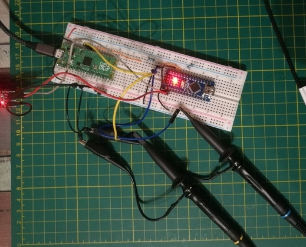

Vor einiger Zeit habe ich schon mal die Aufgabe Photo Manager vom rhme2 (2016) CTF gelöst. [Link Github Gist](https://gist.github.com/53845714nF/7ad4c6eb0c38aae9a725e54859f1b8f2)

Nun wollte ich mich mal an was mit mehr Hardware Bezug wagen.

## Meine Inspiration 🤔

 | 

Das erste Video stammt von LiveOverflow, er zeigt, wie man mit Hilfe- eines FPGA Bordes eine Fault Injection auf das Challenge Fiesta vom rhme2 CTF durchführt.
Das zweite stammt von Stacksmashing, hier zeigt er, wie er mit Hilfe von einem Raspberry Pico eine Fault Injection auf ein Apple AirTag durchführt, um damit, an die Firmware des Tag zu gelangen.

In mir kam die Idee auf, man könnte ja beides verbinden, also Raspberry Pico gegen den Ardunio Nano. ⚔️

## Kurze Theorie 👨‍🏫
Die Grundidee ist es der CPU, für wenige Augenblicke den Strom zu klauen und zu hoffen, dass sie sich während dieser Zeit verrechnet bzw. das sie einzelne Instruktions überspringt.

## Aufsetzen des Zielsystem 🎯
Das Ziel ist ein Arduino Nano, das Herzstück ist der Mikrocontroller ATmega328. Also der Chip, der auch auf dem Arduino Uno verwendet wurde und mittlerweile in Hunderten von Projekten benutzt wurde.

Für das CTF werden die Hex Files direkt auf den Arduino geflasht mit folgenden Befehl:

`avrdude -c arduino -p atmega328p -P /dev/ttyUSB* -b115200 -u -V -U flash:w:CHALLENGE.hex`

Leider ging das bei mir nicht auf Anhieb mit dem eingebauten USB Port. Ich habe dann die ISP Schnittstellen verwendet. Um mit diesem zu reden, habe ich ein USBasp benutzt.

Um diesen zu verwenden, muss die noch folgende Änderung im Betriebssystem vorgenommen werden:

`vim /etc/udev/rules.d/60-objdev.rules`

Und folgenden Inhalt einfügen:


SUBSYSTEM=="usb", ENV{DEVTYPE}=="usb_device", SYSFS{idVendor}=="16c0", SYSFS{idProduct}=="05dc", MODE="0666"


dann noch:

`sudo /etc/init.d/udev restart` oder rechner Neustarten.

Dies ist nötig, damit der USB Stick vom Betriebssystem erkannt wird und wir mit diesen interagieren können.

Man kann nun das Hex File mit folgenden Befehl flashen:

`avrdude -c usbasp -p atmega328p -P usb -b115200 -u -V -U flash:w:fiesta.hex`

Nun kann der Arduino mit dem Rechner via USB verbunden werden. Mit folgendem Befehl können wir sehen, was dieser schreibt:

`screen /dev/ttyUSB0 19200`

Ist eine ganz normale Kommunikation über UART. Ich fand die Baudrate ein wenig ungewöhnlich, aber vielleicht mache ich, so was auch einfach zu selten. 😅

Uns begrüßt nun folgender Text:


RHME2 FI level 1.

Chip status: LockLockLockLockLockLockLockLockLockLockLockLockLockLockLockLockLockLockLockLockLockLockLockLockLockLockLockLockLockLockLockLockLockLockLockLockLockLockLockLockLockLockLockLockLockLockLockLockLockLockLockLockLockLockLockLo
ckLockLockLockLockLockLockLockLockLockLockLockLockLockLockLockLockLockLockLockLockLockLockLockLockLockLockLockLockLockLockLockLockLockLockLockLockLockLockLockLockLockLockLockLockLockLockLockLockLockLockLockLockLockLockLockLockLockLockL
ockLockLockLockLockLockLockLockLockLockLockLockLockLockLockLockLockLockLockLockLockLockLockLockLock


Man kann sich ja mal grob im Kopf überlegen, was für ein Code hier ausgeführt wird:



Serial.println("RHME2 FI level 1.");
Serial.print("Chip status:");

while(true) {
  Serial.print("Lock");
}

Serial.print("FLAG");



Das geht so ungefähr in meinem Kopf vor, man als Programmierer, würde sehen, dass wir durch das `while(true)` in einer Endlosschleife sind und diese kann nicht verlassen werden.
Aber da in dem CTF immer von Fault Injection gesprochen wird, heißt es, dass wir an dieser Stelle glitchen müssen. Ich denke, dass die Entwickler noch ein paar Mechanismen benutzen, die das Glitchen erleichtern, da 
es eine einfache Challenge ist.

## Aufsetzen des Angreifersystem 🏹
Eigentlich wollte ich mich selbst mal wagen den Pico zu programmieren, aber durch ein wenig rumgoogel bin ich auf folgenden Blog gestoßen: [Link zum Blog](https://deralchemist.wordpress.com/2021/05/28/raspberry-pico-voltage-glitcher/)

Anscheinend hatte schon mal Einer die selbe Idee wie ich und er hat seine Software auch auf [Github](https://github.com/MKesenheimer/PicoGlitcher) veröffentlicht. Sie besteht aus einer Firmware für den Pico und einen Python Script mit dem der Puls gesteuert werden kann.

### Firmware
Hier nochmal kurz beschrieben, wie das Erstellen und Aufbringen der Firmware funktioniert:
Ich empfehle, bevor man selbst los legt, noch mal folgendes [Video](https://www.youtube.com/watch?v=JhajoAyP8e4) zu gucken. Es stammt von Low Level Learning und er gibt kurz einen Überblick, wie der Pico mit C++ programmiert werden kann.

Für uns heißt es Repo Klonen: 

`git clone https://github.com/MKesenheimer/PicoGlitcher.git`

Ein `build` Ordner erstellen dann `cmake ..` und dann `make` .

Ich hatte in kleines Problem mit dem Pico Sdk. Ich musste einmal ins pico-sdk wechseln.

`cd /home/rar/Dokumente/pico/pico-sdk`

und dann Folgendes ausführen:

`git submodule update --init`

Danach gab es beim Kompilieren auch keine Fehler mehr. Am Ende entsteht ein `.uf2` File.

Dieses `.uf2` File kann dann auf den Pico kopiert werden, dass sich dieser als Speicher Laufwerk in den Rechner einhängt.

Hier ein erster Test am Pin des Picos:

In dem Video ist zu sehen, wie die Spannung einen kurzen Moment hoch schnellt. Genau das, was erreicht werden soll.
Das wird über das Python Script gesteuert:

`./controller.py /dev/ttyACM0 --timeout 0.01 -p 10 10 1 -d 10 15 1`

## Verbindung der beiden Mikrocontroller 👫
Der für mich wahrscheinlich schwierigste Part. Zu Glück hatte ich hier Hilfe aus dem [Potsdammer Chaostreff](https://www.ccc-p.org/).

Danke an [Christoph](https://github.com/chsterz), der mir einen seiner Transistoren gesponsert hat. Und großes Dankeschön an [tz](https://github.com/123TzTz321), der mir kräftig beim Verbauen und Messen der Transistoren geholfen hat.

Es wurde ein `BC547C` NPN Bipolartransistor verwendet. Beim Aufbau mussten wir sehr viel messen, hier ein paar Bilder: 

 | 

Das linke Bild zeigt die beiden Messspitzen unseres Versuches. Das gelbe Kabel geht in den Pin von Pico, hier wird der Puls gemessen.
Der blaue Jumper geht an den Ausgang des Transistors. Auf dem rechten Bild sieht man nun, dass der gelbe Graph nach oben geht und damit den Transistor schaltet.
Dieser hier in blau eingezeichnete Graph geht kurzzeitig nach Ground.

Hier noch einmal der komplette Aufbau:

In Real:

Am Computer:

**Hinweis 1: das orange Kabel vom Transistor sollte nicht so lange an dem 5V Pin des Arduino liegen.**

Da der Arduino sich neu startet und dann der Glitch noch einmal wiederholt wird, kann hierbei die Firmware beschädigt werden.

**Hinweis 2: Es wird ein externer USB-UART-Wandler verwendet.**

Die Power Leitung wird nicht verwendet da der Arduino Nano sonst zu viel Strom bekommen könnte.

Ach so das wichtigste ... die Flagge 🚩

 

