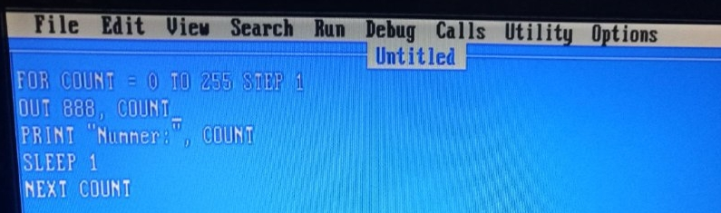
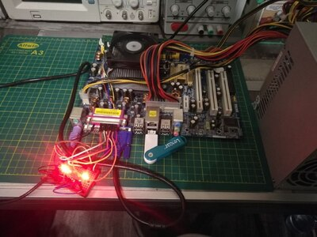
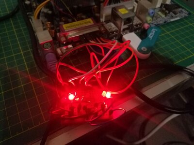
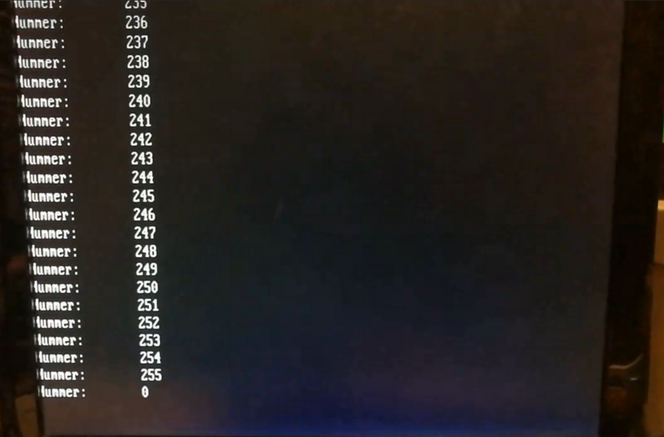

FreeDOS is an open-source operating system designed to be compatible with MS-DOS.
It was mainly developed to run old programs and games on modern hardware.
Exploring these older systems offers a fascinating glimpse into the history of operating systems,
especially when we realize how many mechanisms we take for granted today simply didn’t exist back then.

I’m not even talking about graphical user interfaces but rather basic security principles.
For example, DOS systems lack the separation between kernel space and user space,
which is a core feature of modern operating systems.
This separation, often referred to as privilege levels or ring architecture,
ensures stability and security by preventing unauthorized access.

## What Are Privilege Levels?

Modern operating systems use a ring architecture that defines different privilege levels for running code. These levels range from Ring 0 (Kernel Mode) to Ring 3 (User Mode):

- **Ring 0** (Kernel Mode): This is where the OS kernel runs, with direct access to the hardware. Programs running in this mode have complete control over the system, making security crucial.
- **Ring 3** (User Mode): Regular programs and applications run here. They can’t directly access the hardware and must make requests through the kernel, which helps secure the system.

In contrast, FreeDOS operates without this separation. Every process can access hardware directly, which offers flexibility but also presents security risks.

## QBasic and the Parallel Port

One interesting example of how easy hardware access used to be is working with the parallel port. I found a great [Youtube Video](https://www.youtube.com/watch?v=7D-JES4BnTw) that demonstrates how to control the parallel port with basic QBasic code.

Nowadays, accessing hardware directly without special permissions or drivers would be unthinkable. But with FreeDOS, it’s very straightforward.

Here’s a guide on how to control the parallel port using FreeDOS and QBasic:

1. Use Rufus to copy FreeDOS onto a USB stick.
2. Download [QBasic](https://www.qbasic.net/de/qbasic-downloads/compiler/qbasic-compiler.htm) (Version 7.1) and place it on the USB stick.
3. Boot the target system from the USB stick.
4. Navigate to the QBasic directory: `cd bin`
5. Start QBasic: `qbx`

Here’s a small program that counts from 1 to 255 and sends the number
to the parallel port in binary form while also displaying it on the screen:

 
FOR COUNT = 0 TO 255 STEP 1
OUT 888, COUNT 
PRINT "Number: ", COUNT 
SLEEP 1 
NEXT COUNT 


The number `888` corresponds to the parallel port.
The setup involves connecting the parallel port’s data lines to the positive end of LEDs. All LEDs are connected to the parallel port’s `GND`.

Here are two photos of the setup:

 | 

And here’s a short video showing the counting process:

