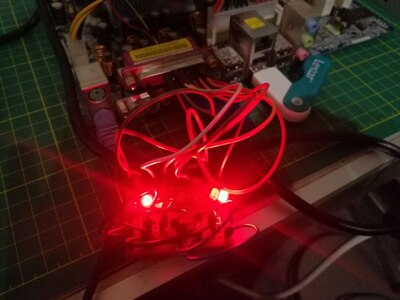
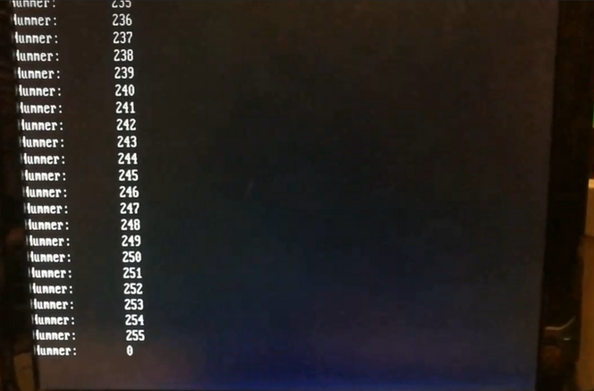

Ich möchte kurz mal ein Wort über FreeDOS verlieren. Es ist ein Betriebsystem, dass die Kompatibilität zu MS-DOS schaffen möchte.
Grundidee ist es, alte Programm haupsächlich Spiele wieder zu laufen zu bekommen.
Ich finde es recht interessant, wenn man mal in die Vergangenheit der Betriebssystem gucken kann. Und man merkt, dass viele der Mechanismen, die wir von einem Betriebssystem gewohnt sind, einfach nicht existieren.
Ich spreche da nicht mal von einer GUI, ich meine auch Prinzipien, die mein System absichern.

Ich habe ein cooles Video gefunden, dass zeigt, wie man mit simplen QBasic den Parallel Port des Computers steuern kann. [Link zum Video auf YouTube](https://www.youtube.com/watch?v=7D-JES4BnTw)

Ich denke mal, das wäre heute undenkbar und nur mit erheblichen Aufwand zu bewerkstelligen.
Eine Hierarchie mit Kernel und Userspace gab es einfach noch nicht.

Aber ich wollte mal gucken, ob es wirklich so einfach ist, mit FreeDOS dieses Ziel zu erreichen und stellt sich raus, ´das ist es. 😜

Einfach mit Rufus FreeDos auf einen Stick ziehen, dann noch [QBasic](https://www.qbasic.net/de/qbasic-downloads/compiler/qbasic-compiler.htm) in Version 7.1 daneben kopieren.

Dann auf dem Zielsystem vom USB-Stick booten und ins QBasic Verzeichnis wechseln: `cd bin`

Und dann QBasic starten: `qbx`

Folgendes Mini Programm, zählt von 1 bis 255 und gibt die Zahl auf dem Monitor sowie in Binärer Zählweise auf der Parallele Schnittstelle aus.

Das folgende Bild zeigt mein Programm:

Die `888` bei dem `OUT` Befehl bedeutet, dass es sich hierbei um den Parallelport handelt.

Hier zwei Fotos des Aufbaues:

 | 

Die Jumper gehen in die Data Leitungen des Parallel Ports, diese sind dann mit dem positiven Ende einer LED verbunden.
Als letztes müssen alle LEDs noch mit `GND` verbunden werden, dieser kommt auch aus dem Parallel Port.

Hier ein kleines Video:

