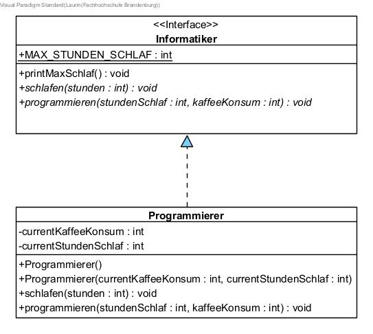
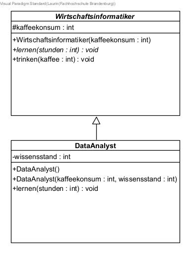
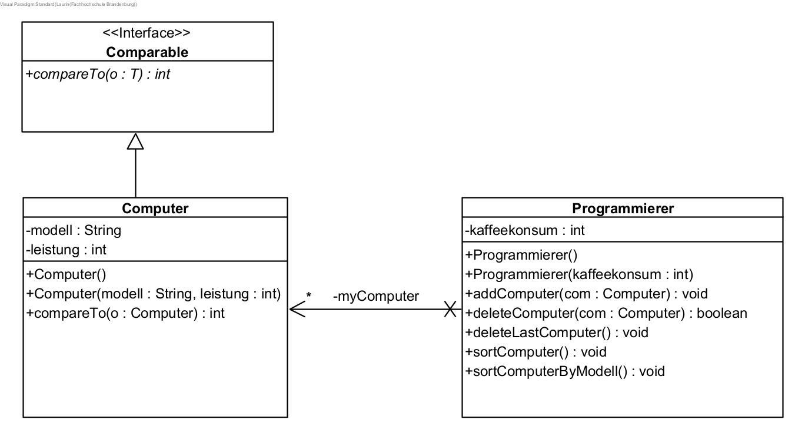
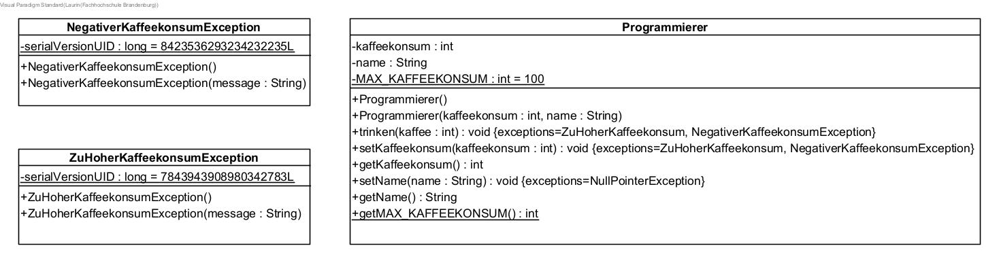

Danke an [Max](https://github.com/maxriedel03)

## Getter/ Setter 



## Standert Methoden


## Imports

java.util.*
java.lang.*
java.io.*


## Enum

public enum Spezies {
	SCHWALBE("Schwalbe"), WILDGANZ("Wildganz");

	private String name;
	
	private Spezies(String name) {
		this.name = name;
	}
	
	public String toString() {
		return name;
	}

}


## Comparable


## Interfaces



## Abstrakte Klassen



## Collections



## Iterator

Iterator <SchuhPaar> iterator = tester.getShuhKollektion().iterator();

while(iterator.hasNext()){
	iterator.next().toString();
}



## Exceptions

  - checkedException -> extends Exception
  - uncheckedException -> extends RuntimeException



## IO

[IO link](https://www.tutorialspoint.com/java/java_serialization.htm)