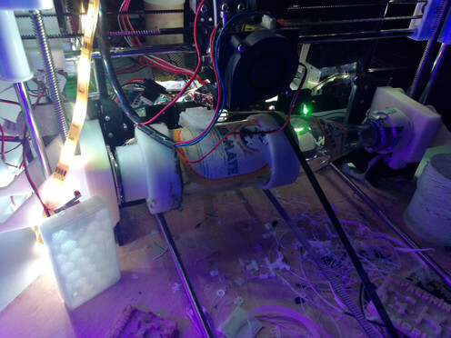

I often hear the term "hacker," unfortunately usually in a very negative context. It is often used as a synonym for internet criminals, which I find very regrettable. That's why I want to clear up this misconception.

My favorite quote comes from Wau Holland, the founder of the Chaos Computer Club, the largest association of hackers in Europe: "A hacker is someone who tries to find a way to make toast with a coffee machine." For me, the creative use of technology is at the forefront. 🎨👨‍💻

I want to give two examples that I have come across in recent years:

## 3D printing on Mate bottles 🍾

I found the first example at the [Chaos Communication Congress](https://en.wikipedia.org/wiki/Chaos_Communication_Congress). 3D printing is done on a round object, which has the advantage of being able to print curved objects, such as chains.

The idea is quite creative, but a lot of experience is required for the technical effort. For this project, a custom G-code generator was even written.

## Typewriter with network connection 🖨️

I found the second project at the [Potsdam Chaostreff](https://www.ccc-p.org/). An old GDR typewriter was reverse-engineered to allow text to be sent and printed via the network.

Here, too, the hackers had to become familiar with the protocol of the typewriter to implement it themselves. They found their own uses, such as a network connection. [Here you will find a description and software for it.](https://github.com/Chaostreff-Potsdam/erika3004)

I deliberately chose these two examples because they do not represent security-related "hacks" and yet require a certain level of skill and creativity.
