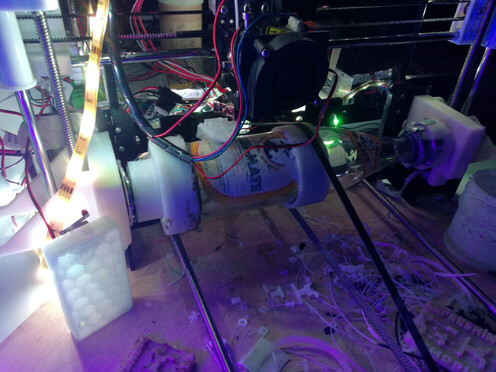
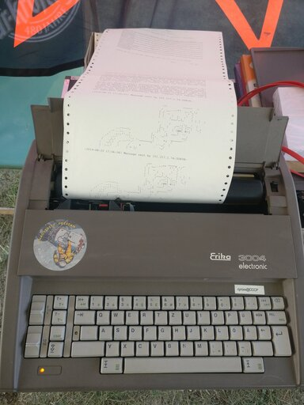

Ich höre oft den Begriff "Hacker", leider meist in einem sehr negativen Kontext. Es wird oft als Synonym für Internet-Kriminelle verwendet, was ich sehr bedauerlich finde. Deshalb möchte ich mit diesem Irrglauben aufräumen.

Mein Lieblingszitat stammt von Wau Holland, dem Gründer des Chaos Computer Clubs, dem größten Zusammenschluss von Hackern in Europa: "Ein Hacker ist jemand, der versucht, einen Weg zu finden, wie man mit einer Kaffeemaschine Toast zubereiten kann." Für mich steht der kreative Umgang mit Technik im Vordergrund. 🎨👨‍💻

Ich möchte zwei Beispiele nennen, die mir in den letzten Jahren begegnet sind:

## 3D-Druck auf Mate Flaschen 🍾

Das erste Beispiel habe ich auf dem [Chaos Communication Congress](https://de.wikipedia.org/wiki/Chaos_Communication_Congress) gefunden. Dabei wird auf einem runden Objekt 3D-gedruckt. Dies hat den Vorteil, dass gewölbte Objekte gedruckt werden können, wie z.B. Ketten.

Die Idee ist recht kreativ, aber auch für den technischen Aufwand benötigt man viel Erfahrung. Für dieses Projekt wurde sogar ein eigener G-Code-Generator geschrieben.

## Schreibmaschine mir Netzwerkanschluss 🖨️

Das zweite Projekt habe ich im [Potsdamer Chaostreff](https://www.ccc-p.org/) gefunden. Dabei wurde der Anschluss einer alten DDR-Schreibmaschine Reverse-Engineered, sodass man über das Netzwerk Text an die Schreibmaschine senden und ausdrucken kann.

Auch hier mussten sich die Hacker mit dem Protokoll der Schreibmaschine vertraut machen, um es dann selbst zu implementieren. Sie fanden eigene Verwendungsmöglichkeiten wie z.B. einen Netzwerkanschluss. [Hier](https://github.com/Chaostreff-Potsdam/erika3004) finden Sie eine Beschreibung und Software dazu.

Diese beiden Beispiele habe ich bewusst gewählt, da sie keine sicherheitsrelevanten "Hacks" darstellen und dennoch ein gewisses Können und Kreativität erfordern.
