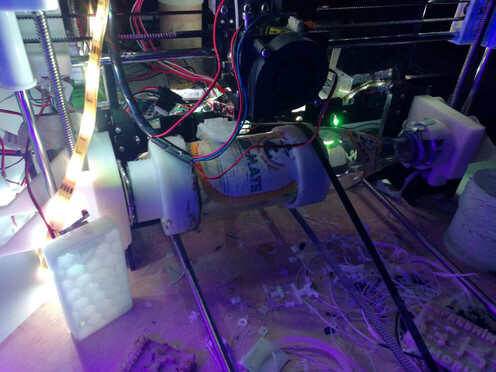
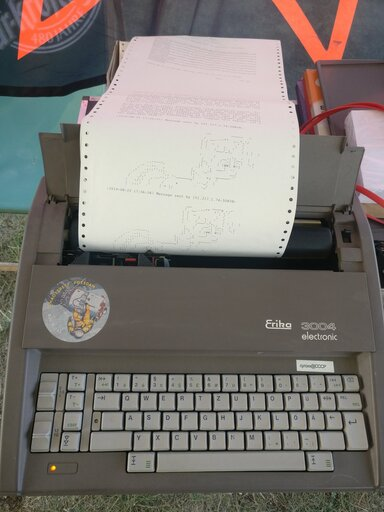

Ich höre öfter den Begriff des "Hackers", leider oft in einem sehr negativen Kontext.
Es steht oft als Synonym für Internet Kriminelle, was ich leider sehr schade finde. Darum möchte ich mal mit diesen Irrglaube aufräumen. 

Mein Lieblings Zitat stammt von Wau Holland (Gründer des Chaos Computer Clubs, der größte Zusammenschluss von Hackern in Europa) er sagte: 

"Ein Hacker ist jemand, der versucht einen Weg zu finden, wie man mit einer Kaffeemaschine Toast zubereiten kann."
Für mich heißt es, der kreative Umgang mit Technik steht im Vordergrund. 🎨👨‍💻

Ich möchte mal zwei Beispiele, die mir in den letzten Jahren untergekommen sind:

## 3D Druck auf Mate Flaschen 🍾

Das erste habe ich auf dem [Chaos Communication Congress](https://de.wikipedia.org/wiki/Chaos_Communication_Congress) gefunden, es wird auf einem runden Objekt 3D gedruckt.
Es gib dadurch den Vorteil, Objekte gewölbt auszudrucken, des weiteren kann man runde Objekte wie z.B. Ketten herstellen.

Die Idee ist recht kreativ, aber auch für den technische Aufwand, braucht man recht viel Erfahrung, so wurde für dieses Projekt ein eigener G-Code Generator geschrieben.

## Schreibmaschine mir Netzwerkanschluss 🖨️

Das zweite Projekt habe ich im [Potsdamer Chaostreff](https://www.ccc-p.org/) gefunden.
Es wurde der Anschluss einer alten DDR Schreibmaschine Reverse Engineert, sodass man über das Netzwerk Text an die Schreibmaschine senden kann und dieser dann ausgedruckt wird.
Auch hier mussten sich die Hacker klar werden, wie so ein Protokoll funktioniert, um es dann selbst zu implementieren. Um dann wiederum eigene Verwendungsmöglichkeiten wie z.B. ein Netzwerk Anschluss zu finden.
[Hier zur Beschreibung und Software](https://github.com/Chaostreff-Potsdam/erika3004)

Diese beiden Beispiele sind bewusst gewählt, da sie keine sicherheitsrelevanten "Hacks" sind und doch benötigen sie ein gewisses Können und Kreativität. 