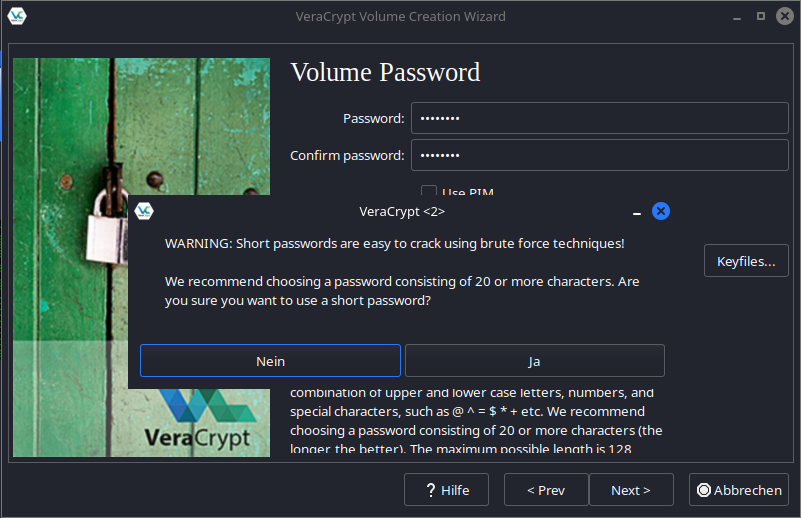

Hashcat is a powerful tool for password cracking.
While it’s often used for cracking MD5 hashes, today, we’ll focus on VeraCrypt.
We’re not attacking the encryption itself but instead exploiting weak passwords, a common vulnerability.

## Target 🎯

We’ll start by creating a VeraCrypt file container.
We’ll stick with the default encryption method, AES,
and use SHA-512 as the hashing algorithm, which is VeraCrypt's default.

Here’s the key part: we’ll deliberately choose a weak password.
VeraCrypt, rightfully so, warns us that this password is susceptible to brute-force attacks.

## A Quick Overview 👨‍🏫

A hash is a one-way function: you input a value and get a unique output, known as the hash.
The catch is that it’s practically impossible to reverse the process to retrieve the original input – like trying to deduce the exact ingredients from a cooked meal.
However, there’s a way to find the original password: by feeding different inputs into the hash function and comparing the outputs with the target hash.
This method is the core of password cracking.

## Targeting the Goal 🏹

### Hash Types

Hashcat supports a wide range of hash types, which can be listed with `hashcat --help`.
You select these types using the `-m` (mode) or `--hash-type` option.
MD5, for example, is commonly used and has the mode number 0.
For our VeraCrypt case with AES and SHA-512, we’ll use mode 13722.

### Attack Modes

Hashcat offers several attack methods, controlled via the `-a` or `--attack-mode` option.
I’ve tested two methods: dictionary attacks and brute-force attacks.
There are more, such as combining dictionary attacks with rules (e.g., requiring a special character at the end of the password).

#### Dictionary Attacks 📖

A dictionary attack uses a list of potential passwords, trying each one in turn.
Kali Linux comes with several such lists, with the most famous being `rockyou.txt`,
a compilation of passwords from real-world leaks.

You can also create your own wordlists using tools like:

1. `Crunch`: This tool allows you to define the characteristics of the wordlist, such as password length and included characters.

2. `Cewl`: This [tool](https://github.com/digininja/CeWL) crawls websites and generates wordlists based on their content. Surprisingly, some companies actually use terms like their company name as passwords. 🤔

3. `cupp`: The [Common User Password Profiler](https://github.com/Mebus/cupp) creates custom wordlists based on personal information like birthdates or pet names.

Now, onto the actual attack with Hashcat:

`hashcat -a 0 -m 13722 test rockyou.txt  -o cracked.txt`

- `-a 0` specifies a dictionary attack.
- `test` is the VeraCrypt container we're trying to crack.
- `rockyou.txt` is the wordlist we’re using.
- `-o` specifies the output file, in this case, where the cracked password will be saved (cracked.txt).

#### Brute-force 👊

A brute-force attack systematically tests all possible password combinations.
This method is extremely resource-intensive and rarely successful unless the password is very short.

`hashcat -a 3 -m 13722 test ?l?l?l?l?l --increment --increment-min 5`

- `-a 3` indicates a brute-force attack.
- `?l?l?l?l?l` instructs Hashcat to test lowercase letters.
- The `--increment` option gradually increases the password length, starting from 5 characters.

### Time 🕜

For these tests, I used a somewhat dated GTX 1060.
When it comes to password cracking, more computing power is always better.
In my test, the brute-force attack achieved 168 hashes per second,
and the dictionary attack reached 245 hashes per second – a far cry from the thousands of megahashes per second seen when cracking MD5.