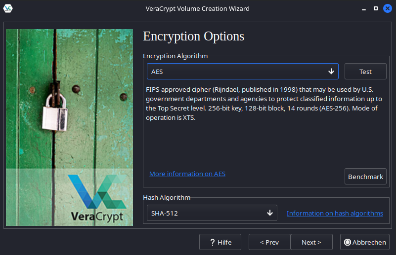
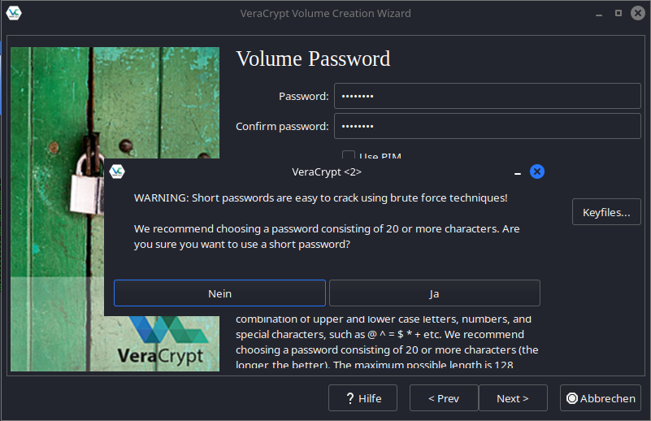

In diesem Post möchte ich etwas über das Cracken vom Passworten schreiben.
Es geht um das Programm Hashcat, dies ist ein Tool, um Passwort zu brechen.

Bei vielen Tutorials wird immer das Cracken von MD5 Hashes beschrieben.

Ich möchte hier mal über das Cracken von Vera Crypt schreiben.
Das ist kein Angriff auf die Verschlüsslung, sondern auf das schwache Passwort, was ich wählen werde.

## Erstellen des Ziels 🎯

Das Erstellen des VeraCrypt File Containers.

Als Verschlüsslung Methode wird normales AES und als Hash Algorithmus SHA-512, dass sind die default Werte von Vera Crypt:

Nun kommt der Knackpunkt, wir wählen ein schwaches Passwort und Vera Crypt weißt richtiger Weise darauf hin, dass dies anfällig für Brute-force Attacken ist.

## Kurze Theorie 👨‍🏫
Bei Hashes handelt es sich um so genannte Einwegfunktion, man gibt einen Wert rein und bekommt ein Ausgabe. Oder hat eine zerhackte Ausgabe.
Es gibt keinen Weg von einem Hash auf den Eingabe Wert zu kommen. Ähnlich wie beim Kochen, wo ich vom Gericht nicht auf die genaue Menge aller Zutaten kommen kann.
Außer man versucht verschiedene Eingaben in die Hashfunktion und vergleicht das Ergebnis mit dem gegebenen Hash.

## Angriff auf das Ziel 🏹

### Hash Types
Hashcat hat viele verschiedene Modi um Hashes anzugreifen. Es gibt eine gigantisch lange Liste, anzeigen lässt sich diese mit `hashcat --help`
Diese Modi können mit dem Parameter `-m` bzw. `--hash-type ` gewählt werden.
Die 0 steht für MD5, diese findet man am häufigsten im Internet. Für unseren Fall brauchen wir aber die 13722, dies geht gegen Vera Crypt AES mit SHA-512.

### Attack Mode
Hashcat hat verschiedenen Angriffs Methoden diese können mit dem Parameter `-a` bzw. `--attack-mode` ausgewählt werden. 
Ich habe mal zwei ausprobiert, das erste sind Wörterbuch Attacken, das Andere war eine Brute-force Attacke. Es gibt noch ein paar mehr, z.B. das Nutzen spezieller Regel.
Im Sinne von hinten muss ein Sonderzeichen, diese kann man dann nochmal mit Wörterbüchern kombinieren.

#### Wörterbuch Attacken 📖
Nochmal kurz erklärt, man hat eine Liste von Wörtern bzw. Strings. In Kali gibt es, z.B. auch eine Menge von Wörterlisten.
Die Bekannteste ist die sogenannte `rockyou.txt`, diese ist aus Leaks entstanden und enthält häufig verwendete Passwörter.

Es gibt auch Tools zum Erstellen von Wörterbüchern, ich möchte mal zwei vorstellen.

Das Erste ist `crunch` mit diesen Tool kann man beschreiben, wie die Wortliste aussehen soll, also wie lang und welche Zeichen drin vorkommen.

Das Zweite ist `cewl` mit diesem Tool kann man eine URL übergeben, es versucht die Webseiten zu durchsuchen und daraus eine Liste zu generieren.
Sehr schlau, da es auch immer noch Unternehmen gibt, die ihren Namen als Passwort verwenden oder dieser darin vorkommt. 🤔

[CeWl auf Github](https://github.com/digininja/CeWL)

Das dritte ist `cupp` die ist ein Tool zum Generieren von individuellen Wörterlisten, es fragt nach privaten Informationen über das anzugreifende Ziel z.B.: Geburtsdaten, Name von Ehepartner/Kinder oder Haustieren. 

[Cupp auf Github](https://github.com/Mebus/cupp)

Aber hier nun die Attacke mit hashcat:

`hashcat -a 0 -m 13722 test rockyou.txt  -o cracked.txt`

Die 0 steht natürlich für Wörterbuch Attacken.

Das `test` ist der verschlüsselte VeraCrypt Container.

Das `rockyou.txt` ist natürlich das Wörterbuch.

Das `-o` steht für Output, es erstellt eine cracked.txt

#### Brute-force 👊
Ìst das rabiate Ausprobieren aller möglichen Textverbindungen.
Dies Attacke ist natürlich rechenintensiver und wird hier in einem echten Fall, wohl nicht von Erfolg gekrönt sein.

`hashcat -a 3 -m 13722 test ?l?l?l?l?l --increment --increment-min 5`

Die 3 steht natürlich Brute-force Attacke.

### Zeit 🕜
Ich möchte noch was zu der Zeit sagen, ich habe für meine Test eine nun doch schon in die Jahre gekommene GTX 1060 verwendet. 
Beim Passwort Cracken gilt je mehr Rechenpower desto besser.

Ich hatte 168 Hashes/s bei der Brute-force Attacke und 245 Hashes/s, dies sind super wenig, wenn man mal so vergleicht, dass man tausende von Mega Hashes/s bei Cracken von MD5 hat.