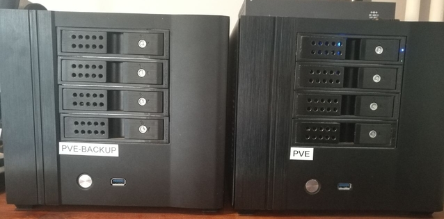

I would like to give you a brief overview of what is behind the terms.

## The Home Server 🏠🖥️
It's about having a server for home a place for all your data that is not somewhere in the cloud.☁️

What is a "server"?

Simplified, a device that takes over certain tasks for others in the network.
Mostly one computer or hardware NAS. One of the most common problems is probably the storage and availability of data. 💾

### Summary
  - mostly one computer 🖥️
  - less services 🖨️💾🎬
  - runs productively 🏋

## The Home Lab 🏠🔬🧪
One of the most famous places on the Internet where everything is about Home Labs is probably [Subreddit Homelab](https://www.reddit.com/r/homelab/).

But what is it exactly?

A place where you can do your experiment in a safe environment.
More often you hear the technical term of an test environment.
The goal is to try out new tools and test procedures. 
Another point of comparison to the home server is that it is also about the structure of the network.
On Reddit you can see RGB lit racks with patch panels, switches, routers and so on.

### Summary
  - several computers 🖥️🖥️
  - many different services
  - does not run productively or encapsulated 🚧
  - often with extra network components 🕸️

## My Setup
I've often asked myself what I'm running now?
Probably a home lab, even if I don't like to call it that.
I run some VM and containers and have also installed a few network components, plus a backup.

Quite unspectacular but these are my babies:

I would like to start a small blog series, in which I show how my "Home Lab" is built.

First comes hardware, software and backup.
Then of course some services I run on it.
To give a small overview, a versioning system, cloud instance, documentation, VPN, config management and in 2021 of course the home automation may not be missing.
And of course I want to make it all secure.🔒
