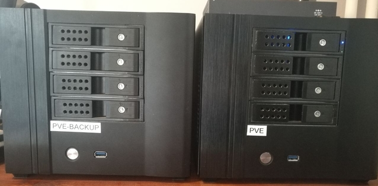

## Der Home Server 🏠🖥️

Fangen wir erst mal mit dem "Home" an, offensichtlich ist das Englisch für "Zu Hause". Und darum geht es, einen Server für zu Hause ein Platz für alle seine Daten die nicht irgendwo in der Cloud liegen. ☁️

Doch was verbirgt sich nun hinter dem Bergriff "Server"?

Vereinfacht ein Gerät, das für andere im Netz bestimmte Aufgaben übernimmt.
Also häufig irgendeine Art von Computer beziehungsweise Hardware NAS. Einer der häufigste Probleme dürfte wohl das Speichern und Bereitstellen von Daten sein. 💾

Der Home Server wird also für den privaten Einsatz genutzt und ist somit im produktiven Einsatz. Des weiteren kann man sagen, dass er oft nur einen bis wenige Dienste beherbergt.

### Zusammenfassung

- Häufig ein Rechner 🖥️
- Weniger Dienste 🖨️💾🎬
- Im produktiver Einsatz 🏋

# Das Home Lab 🏠🔬🧪

Einer der bekanntesten Orte im Internet, wo sich alles um Home Labs dreht, ist wohl [Subreddit Homelab](https://www.reddit.com/r/homelab/).

Aber was ist das nun genau?
Lab ist auch wieder Englisch und heißt Labor. Also ein Ort, an dem Experimente durchgeführt werden, oder was man häufiger hört, eine Testumgebung.
Viele berichten z.B. bei Reddit, es sei ihre Testumgebung, um sich weiterzuentwickeln.
Ziel ist es, neue Werkzeuge auszuprobieren, Verfahren zu testen und zu entwickeln. Aber vor allem, das eigene Können und den Umgang mit der Materie zu erweitern.
Ein weiterer Punkt im Vergleich zum Home Server ist, dass es hier auch um den Aufbau des Netzwerks geht.
Gerade auf Reddit sieht man RGB-beleuchtete Racks mit krassen Patchpanels, Switchen, Routern und so weiter.

### Zusammenfassung

- Mehrere Computer 🖥️🖥️
- Viele unterschiedliche Dienste
- Läuft nicht produktiv oder ist gekapselt vom Produktivsystem 🚧
- Häufig mit extra Netzwerkkomponenten 🕸️

## Mein Setup

Ich habe mir schon häufiger die Frage gestellt, was ich denn jetzt betreibe?
Wahrscheinlich ein Home Lab, auch wenn ich es ungern so nenne.
Ich betreibe einige VMs und Container und habe auch ein paar Netzwerkkomponenten verbaut, dazu kommt noch ein Backup.

Recht unspektakulär, aber das sind meine Babys:

Ich möchte eine kleine Blogreihe starten, in der ich zeige, wie mein "Home Lab" aufgebaut ist.

Als Erstes kommt Hardware und Software, ein kurzer Einblick, was VMs und Container sind, sowie meine Backup-Lösung.
Dann natürlich noch einige Dienste, die ich darauf betrieben werden.
Um einen kleinen Überblick zu geben, ein Versionsverwaltungs, Cloud, Dokumentation, VPN, Config-Management, Monitoring und natürlich darf die Hausautomatisierung nicht fehlen.
Auch die die Absicherung dieser System spielt hier eine Rolle.
