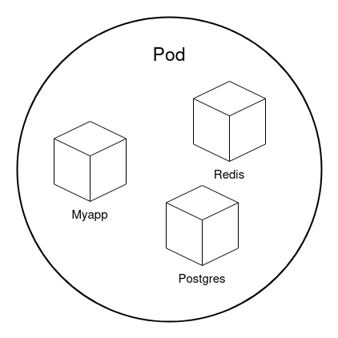
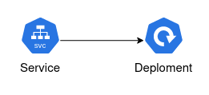
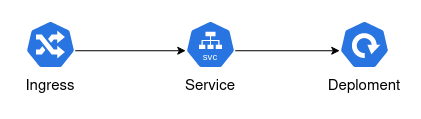
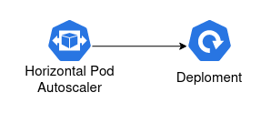

**Kubernetes has emerged as the standard platform for container orchestration. However, to fully leverage its power, it is essential to understand the different resource types Kubernetes provides.**

In this post, I'll focus on explaining some of the key Kubernetes resources, discussing their respective functions and how they work together to create a scalable and flexible environment for modern applications.

## Namespace
One of the simplest resource types is the **Namespace**.
It is a logical partitioning mechanism that helps isolate and organize resources within a cluster.
Namespaces allow multiple environments or teams to operate within the same Kubernetes cluster without affecting each other.
They are especially useful when managing multiple projects or applications in a single cluster.

Key characteristics of namespaces:

- **Resource isolation**: Namespaces logically separate resources (like Pods, Services, and Deployments) within a cluster.
This allows secure isolation of different applications or environments (e.g., development, testing, production).
- **Prevent name conflicts**: Since resources like Pods and Services must have unique names within a namespace, namespaces prevent name conflicts between resources with the same name across different projects or teams.
- **Resource quotas**: Kubernetes allows defining resource quotas for namespaces, limiting the maximum amount of CPU, memory, or other resources that can be consumed within a given namespace. This ensures effective **multi-tenancy** within a Kubernetes cluster.

- **Access control**: Namespaces work with **Role-Based Access Control (RBAC)** to restrict access to resources based on teams or projects.
This ensures that users or groups can only access resources within their own namespace.

- **Default namespaces**: Kubernetes comes with some predefined namespaces:
  - `default`: The default namespace where resources are placed if no other namespace is specified.
  - `kube-system`: Contains Kubernetes system components like the Controller Manager or the Scheduler.
  - `kube-public`: Used for publicly accessible resources.
  - `kube-node-lease`: Stores lease objects for node heartbeats.

Example of creating a namespace: 


## Pods
In Kubernetes, **Pods** are the smallest and most basic computational units that can be deployed and managed.
A Pod represents a single instance of a running application and can contain one or more containers running in a shared environment.

Pods are ephemeral and typically not created directly but managed by higher-level resources like **Deployments**, which ensure the desired number of Pods are always running.

## Deployment
**Deployments** provide a way to manage, update, and scale applications in a controlled and automated manner in Kubernetes. They are at the core of modern, containerized workloads running within a cluster.

Key features of Deployments:

- **Declarative management**: A Deployment defines how many instances (Pods) of an application should be running and which container images to use. Kubernetes ensures that this desired state is reached and maintained.
- **Self-healing**: If Pods crash or experience issues, the Deployment automatically creates new Pods to maintain the desired number.
- **Rolling updates**: Deployments support rolling updates, gradually rolling out new versions of Pods to ensure the application remains available during updates.
- **Rollback**: If an update fails or issues are detected after deployment, you can roll back to a previous version.
- **Scaling**: Deployments make it easy to scale an application by adjusting the number of Pods, either manually or automatically, based on load.

Here is an example of deploying a simple application:


## Service
A **Service** provides **network access** to a Deployment. Since Pods are dynamic and their IP addresses constantly change as they are created, deleted, and restarted, a Service offers stability by assigning a persistent IP address and **DNS name** to access the Deployment.

Key features of Kubernetes Services:

- **Stable network address**: A Service provides a stable IP address and DNS entry, ensuring the Pods remain accessible even when their underlying IP addresses change.
 - **Load balancing**: Services automatically distribute incoming traffic across Pods belonging to the same group, improving availability and resource utilization.
- **Service types**:
  - `ClusterIP`: Makes the Service accessible internally within the Kubernetes cluster via an internal IP address.
  - `NodePort`: Exposes the Service externally via a specific port on all cluster nodes.
  - `LoadBalancer`: Exposes the Service via an external Load Balancer (commonly used in cloud environments).
  - `ExternalName`: Maps the Service to an external DNS name.
- **Service discovery**: Kubernetes uses built-in service discovery mechanisms. A Service is automatically registered in the cluster's DNS, so other Pods can access it via its name.

Services are critical to ensuring Pods remain accessible and reliable over the network,
even when their IP addresses dynamically change.

Example of a LoadBalancer Service:


## Ingress
**Ingress** is a resource that enables **HTTP** and **HTTPS** access to applications running inside a cluster. It acts as a **reverse proxy**, routing external traffic to the appropriate Services based on defined routing rules.

Key features of Ingress:

- **External access**: Ingress allows external access to Kubernetes Services without exposing each Service via its own LoadBalancer or NodePort, providing a single entry point for external traffic.
- **Routing rules**: Ingress supports specific routing rules based on:
  - `Hostnames` (e.g., app.example.com)
  - `Paths` (e.g., /api or /login)
- **TLS support**: Ingress manages TLS for HTTPS connections, using certificates configured at the Ingress level.
- **Load balancing**: Ingress also handles load balancing by distributing incoming traffic to the underlying Pods behind the Services.
- **Advanced features**: Ingress supports features like **URL redirects**, **rate limiting**, **authentication**, and **IP whitelisting**.

To use Ingress, an **Ingress Controller** is required, which interprets the Ingress resource. Popular Ingress Controllers include **NGINX**, **Traefik**, and **HAProxy**.

In summary, Ingress offers an elegant solution to **manage and control HTTP(S) traffic**, with flexible routing rules, centralized TLS management, and additional features for traffic optimization.

Here is an example of an Ingress Resource: 


## Horizontal Pod Autoscaler
The **Horizontal Pod Autoscaler (HPA)** is a resource in Kubernetes that allows **automatic scaling** of Pods based on current application load. The HPA monitors metrics like CPU or memory usage and dynamically adjusts the number of running Pods to ensure the workload is processed efficiently.

Key features of Horizontal Pod Autoscaler:

- **Automatic scaling**: The HPA scales the number of Pods horizontally, creating additional Pods as load increases and removing Pods as load decreases. This ensures optimal resource usage and keeps the application performant.
- **Metrics**: The HPA works with metrics monitored by Kubernetes. By default, it measures CPU usage, but it can also work with other metrics like memory usage, custom metrics (e.g., requests per second), or external metrics (e.g., CloudWatch, Prometheus).
- **Target thresholds**: The HPA uses target thresholds for the metrics. For example, a target CPU usage of 70%. If the Pods exceed this threshold, the HPA scales the application to better distribute the load.
- **Regular checks**: The Horizontal Pod Autoscaler regularly checks the Pods' metrics and adjusts the number of instances accordingly, basing scaling decisions on an average load across all running Pods.

Example of a Horizontal Pod Autoscaler:


## Secret
A **Secret** is a resource for securely storing **sensitive data** like passwords, tokens, or SSH keys.
Secrets allow confidential information to be passed to applications without embedding it in configuration files or code.

Key features of Secrets:

- **Security**: Secrets are handled more securely than regular configuration data (ConfigMaps), as they are stored as Base64-encoded data. For additional protection, they can be encrypted using external mechanisms, like a Key Management System (KMS).
- **Managing sensitive data**: Secrets are used to store confidential data such as API keys, database credentials, or TLS certificates.
- **Different types of Secrets**: Kubernetes supports several types of Secrets, including:
  - `Opaque`: The default type, where arbitrary key-value pairs are stored.
  - `Registry`: Stores credentials for container registries.
  - `TLS`: Stores a TLS certificate and associated private key.
- **Secure delivery**: Secrets can be passed to Pods in different ways:
  - **Environment variables**: Pods can access Secrets as environment variables at runtime.
  - **Volumes*: Secrets can be mounted as files within a Pod's filesystem.
- **Dynamic updates**: If a Secret is updated, Kubernetes can apply these changes to connected Pods automatically, depending on the configuration and mounting strategy.
- **Access restriction**: Through Role-Based Access Control (RBAC), access to Secrets can be restricted so that only authorized users and applications can access them.

Example of creating a Secret:


## Cron Job
A **Cron Job** in Kubernetes is a resource that enables the **automatic execution** of recurring tasks at specified times.
It is based on the Unix cron service concept and is ideal for scheduled tasks that need to run regularly or once at a specified time.

Key features of a CronJob in Kubernetes:

- **Scheduled execution**: CronJobs run tasks at specific, recurring times, defined using a cron format. Common use cases include daily backups, periodic maintenance tasks, or regular report generation.
- **Cron syntax**: The schedule for a CronJob is set using a cron expression, which consists of five fields (minute, hour, day of the month, month, weekday). For example:
  - `*/5 * * * *` runs a job every 5 minutes.
  - `0 2 * * *` starts a job every day at 2:00 AM.
- **Job resource**: A CronJob creates a Job resource that performs the actual work. A Job in Kubernetes guarantees that the specified task runs one or more times until it successfully completes.
- **Error handling and retries**: Kubernetes provides mechanisms to restart Jobs in case of failures. CronJobs leverage this functionality to ensure that recurring tasks run reliably.
- **Parallel execution**: CronJobs offer options to control whether multiple instances of a job can run in parallel or not. You can configure whether a new job should wait until the previous one finishes.
- **Job history retention**: CronJobs can be configured to retain a certain number of completed or failed jobs for tracking purposes in Kubernetes.

Example of a CronJob:


Feel free to reach out via email, LinkedIn, or GitHub Issues for questions and feedback.