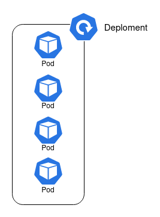

[Die Blog-post ist mit hilfe von ChatGPT entstanden.]

Kubernetes hat sich als Standardplattform für die Orchestrierung von Containern etabliert.
Doch um die volle Leistung dieser Plattform auszuschöpfen, ist es essenziell, die verschiedenen Ressourcentypen zu verstehen, die Kubernetes bietet.
In diesem Beitrag konzentriere ich mich darauf, einige der wichtigsten Ressourcen zu beschreiben. 
Ich werde ihre jeweiligen Funktionen beleuchten, wie sie zusammenarbeiten, um eine skalierbare und flexible Umgebung für moderne Anwendungen zu schaffen.

## Namespace
Der einfachste Ressourcentypen ist wohl der **Namespace**, er ist eine logische Trennungseinheit, die dazu dient, Ressourcen innerhalb eines Clusters zu isolieren und zu organisieren.
Er ermöglicht es, verschiedene Umgebungen oder Teams innerhalb desselben Kubernetes-Clusters zu betreiben, ohne das sie sich gegenseitig beeinflussen.
Namespaces sind besonders nützlich, wenn mehrere Projekte oder Anwendungen in einem Cluster verwaltet werden.

Wichtige Merkmale von Namespaces:

- **Ressourcentrennung**: Namespaces trennen die Ressourcen (wie Pods, Services, Deployments) innerhalb eines Clusters logisch voneinander ab. Dies erlaubt es, verschiedene Anwendungen oder Umgebungen (z. B. Entwicklung, Test, Produktion) sicher zu isolieren.
- **Namenskonflikte verhindern**: Da Ressourcen wie Pods und Services innerhalb eines Namespaces einen eindeutigen Namen haben müssen, verhindern Namespaces Namenskonflikte zwischen gleichnamigen Ressourcen in unterschiedlichen Projekten oder Abteilungen.
- **Ressourcenkontingente (Resource Quotas)**: Kubernetes ermöglicht es, Ressourcenkontingente für Namespaces festzulegen. Damit kann die maximale Menge an CPU, Speicher oder anderen Ressourcen begrenzt werden, die innerhalb eines bestimmten Namespaces verwendet werden dürfen. Ein Namespaces unterstützt somit, die **Mehrmandantenfähigkeit** von Kubernetes-Clustern.

- **Zugriffssteuerung**: Namespaces können in Kombination mit **Role-Based Access Control (RBAC)** verwendet werden, um den Zugriff auf bestimmte Ressourcen auf Team- oder Projektbasis zu beschränken. Dadurch können bestimmte Benutzer oder Gruppen nur auf Ressourcen in ihrem eigenen Namespace zugreifen.

- **Standard-Namespace**: Kubernetes hat einige vordefinierte Namespaces, darunter:
  - `default`: Der Standard-Namespace, in den Ressourcen platziert werden, wenn kein anderer Namespace explizit angegeben ist.
  - `kube-system`: Dieser Namespace enthält Kubernetes-Systemkomponenten wie den Controller Manager oder den Scheduler.
  - `kube-public`: Dieser Namespace wird für öffentlich zugängliche Ressourcen verwendet.
  - `kube-node-lease`: Hier werden Lease-Objekte für die Knotenüberwachung gespeichert.

Beispiel zur Erstellung eines Namespaces:


## Pods
In Kubernetes sind **Pods** die kleinste und grundlegende Recheneinheit, die auf der Plattform bereitgestellt und verwaltet wird.
Ein Pod stellt eine einzelne Instanz einer laufenden Anwendung dar, die einen oder mehrere Container umfassen kann, die in einer gemeinsamen Umgebung laufen.

Pods sind kurzlebig und werden üblicherweise nicht direkt erstellt, sondern von Ressourcen wie **Deployments** verwaltet, die sicherstellen,
dass die gewünschte Anzahl von Pods immer läuft.

## Deployment
**Deployments** ermöglichen das Verwalten, Aktualisieren und Skalieren von Anwendungen auf eine kontrollierte und automatisierte Weise in Kubernetes.
Sie sind das Herzstück moderner, containerisierter Workloads, die in einem Cluster betrieben werden.

Wichtige Merkmale von Deployments:

- **Deklaratives Management**: Ein Deployment beschreibt, wie viele Instanzen (Pods) einer Anwendung laufen sollen und welche Containerimages verwendet werden. Kubernetes kümmert sich dann darum, diesen Zustand zu erreichen und zu halten.
- **Selbstheilung**: Wenn Pods abstürzen oder unvorhergesehene Probleme auftreten, startet das Deployment automatisch neue Pods, um die gewünschte Anzahl aufrechtzuerhalten.
- **Rolling Updates**: Deployments unterstützen nahtlose Updates, indem sie neue Versionen von Pods schrittweise bereitstellen (Rolling Updates). Dabei wird sichergestellt, dass die Anwendung kontinuierlich verfügbar bleibt, während alte Pods durch neue ersetzt werden.
- **Rollback**: Falls ein Deployment fehlschlägt oder ein Fehler nach einer Aktualisierung entdeckt wird, können Deployments auf frühere Versionen zurückgesetzt werden.
- **Skalierung**: Mit Deployments lässt sich eine Anwendung leicht skalieren, indem man die Anzahl der laufenden Pods anpasst, entweder manuell oder automatisch, basierend auf der Auslastung.

Hier das Deploment einer einfachen Anwendung:


## Service
Ein **Service** ermöglicht es **Netzwerkzugriff** auf ein Deploment zu gewährleisten.
Da Pods dynamisch erstellt, gelöscht und neu gestartet werden können, ändert sich ihre IP-Adresse ständig.
Ein Service schafft hier Beständigkeit, indem er eine stabile **IP-Adresse** und einen **DNS-Namen** zur Verfügung stellt,
unter dem das Deploment erreichbar ist.

Wichtige Merkmale eines Kubernetes-Services:

- **Stabile Netzwerkadresse**: Der Service bietet eine feste IP-Adresse und einen DNS-Eintrag, unter dem er erreichbar ist.
Diese Adresse ändert sich nicht, selbst wenn die zugrundeliegenden Pods aktualisiert oder neu erstellt werden.
- **Lastverteilung (Load Balancing)**: Services verteilen den eingehenden Netzwerkverkehr automatisch auf die Pods, die zur gleichen Gruppe gehören, um die Last zu verteilen. Dies sorgt für eine bessere Verfügbarkeit und Ressourcennutzung.
- **Service-Typen**:
  - `ClusterIP`: Macht den Service innerhalb des Kubernetes-Clusters über eine interne IP-Adresse verfügbar.
  - `NodePort`: Öffnet den Service über eine feste Portnummer auf allen Nodes des Clusters nach außen.
  - `LoadBalancer`: Stellt den Service über einen externen Load Balancer bereit (wird häufig in Cloud-Umgebungen verwendet).
  - `ExternalName`: Mappt den Service auf einen externen DNS-Namen.
- **Service Discovery**: Kubernetes nutzt integrierte Mechanismen zur automatischen Dienstentdeckung. Ein Service wird im DNS des Clusters registriert, sodass andere Pods ihn über seinen Namen ansprechen können.

Ein Kubernetes-Service ist also entscheidend, um Pods beständig und zuverlässig über das Netzwerk zugänglich zu machen, selbst wenn sich ihre IP-Adressen im Cluster dynamisch ändern.

Hier ein Bespiel eines LoadBalancer Services:


## Ingress
**Ingress** ist eine Ressource, die den **Zugriff auf Anwendungen** innerhalb eines Clusters über **HTTP** und **HTTPS** ermöglicht.
Es fungiert als eine Art **Reverse Proxy**, der eingehenden Verkehr an die entsprechenden Services weiterleitet, basierend auf definierten Routing-Regeln.

Wichtige Merkmale von Ingress:
- **Externer Zugriff**: Ingress erlaubt den externen Zugriff auf Kubernetes-Services, ohne dass jeder Service über einen eigenen LoadBalancer oder NodePort verfügbar gemacht werden muss. Es bietet eine zentrale Anlaufstelle für den Datenverkehr von außen.
- **Routing-Regeln**: Mit Ingress können spezifische Routing-Regeln definiert werden, die bestimmen, welcher HTTP/HTTPS-Verkehr zu welchem Service geleitet wird. Dies erfolgt meist auf Basis von:
  - `Hostnamen` (z. B. app.example.com)
  - `Pfaden` (z. B. /api oder /login)
- **TLS-Unterstützung**: Ingress kann TLS (Transport Layer Security) für HTTPS-Verbindungen verwalten, indem es TLS-Zertifikate verwendet, die auf der Ingress-Ebene konfiguriert sind.
- **Load Balancing**: Ingress führt ebenfalls **Load Balancing** durch, indem es eingehenden Verkehr auf die dahinterliegenden Pods verteilt, die über Services verfügbar gemacht werden.
- **Erweiterte Funktionen**: Ingress unterstützt erweiterte Funktionen wie **URL-Weiterleitungen**, **Ratenbegrenzungen**, **Authentifizierung** und **Whitelisting** von IP-Adressen.

Um Ingress nutzen zu können, wird ein **Ingress Controller** benötigt.
Dieser ist eine Komponente im Kubernetes-Cluster, die die Ingress-Ressource interpretiert. 
Gängige Ingress-Controller sind **NGINX**, **Traefik** oder **HAProxy**.

Zusammengefasst bietet Ingress eine elegante Möglichkeit, **HTTP(S)-Verkehr zu verwalten und zu steuern**, indem es flexible Routing-Regeln, zentrale TLS-Verwaltung und zusätzliche Features zur Optimierung des Datenverkehrs bereitstellt.

Hier ein Beispiel für eine Ingress Resource:


## Horizontal Pod Autoscaler
Der **Horizontal Pod Autoscaler (HPA)** in Kubernetes ist eine Ressource, die **automatische Skalierung** von Pods basierend auf der aktuellen Auslastung einer Anwendung ermöglicht.
Der HPA überwacht Metriken wie CPU- oder Speicherauslastung und passt die Anzahl der laufenden Pods dynamisch an, um sicherzustellen, dass die Workload effektiv verarbeitet wird.

Wichtige Merkmale des Horizontal Pod Autoscalers:

- **Automatische Skalierung**: Der HPA skaliert die Anzahl der Pods einer Anwendung horizontal, indem er bei steigender Last zusätzliche Pods erstellt und bei sinkender Last Pods entfernt. Dies sorgt für eine optimale Ressourcennutzung und hält die Anwendung performant.
- **Metriken**: Der HPA basiert auf Metriken, die von Kubernetes überwacht werden. Standardmäßig wird die **CPU-Auslastung** gemessen, aber auch andere Metriken wie **Speicherauslastung**, **benutzerdefinierte Metriken** (z. B. Anfragen pro Sekunde) oder externe Metriken (z. B. CloudWatch, Prometheus) können verwendet werden.
- **Zielvorgaben**: Der HPA arbeitet mit Zielwerten für die jeweiligen Metriken. Zum Beispiel könnte eine Ziel-CPU-Auslastung von 70 % festgelegt werden. Wenn die Pods diese Schwelle überschreiten, skaliert der HPA die Anwendung, um die Last besser zu verteilen.
- **Regelmäßige Überprüfung**: Der HorizontalPodAutoscaler überprüft in regelmäßigen Abständen die Metriken der Pods und passt die Anzahl der Instanzen entsprechend an. Die Skalierungsentscheidungen basieren dabei auf einem Durchschnittswert der Last über alle laufenden Pods.

Beispiel für einen Horizontal Pod Autoscaler:


## Secret
Ein **Secret** in Kubernetes ist eine Ressource, die **sensible Daten** wie Passwörter, Tokens oder SSH-Schlüssel speichert und verwaltet.
Secrets ermöglichen es, vertrauliche Informationen sicher an Anwendungen zu übergeben, ohne diese Daten in den Konfigurationsdateien oder dem Code zu hinterlegen.

Wichtige Merkmale von Secrets:

- **Sicherheit**: Secrets werden in Kubernetes sicherer behandelt als normale Konfigurationsdaten (ConfigMaps), da sie als Base64-codierte Daten gespeichert werden. Um zusätzlichen Schutz zu gewährleisten, können sie bei Bedarf durch eine externe Verschlüsselung gesichert werden, beispielsweise mit einem Key Management System (KMS).
- **Vertrauliche Daten verwalten**: Secrets werden verwendet, um vertrauliche Informationen wie API-Schlüssel, Datenbank-Anmeldedaten oder TLS-Zertifikate zu speichern und an Pods weiterzugeben.
- **Verschiedene Secret-Typen**: Kubernetes unterstützt verschiedene Arten von Secrets, darunter:
  - `Opaque`: Der Standardtyp, bei dem beliebige Schlüssel-Wert-Paare gespeichert werden können.
  - `Registry`: Speichert Anmeldeinformationen für Registries.
  - `TLS`: Speichert ein TLS-Zertifikat und den zugehörigen privaten Schlüssel.
- **Sichere Bereitstellung**: Secrets können auf verschiedene Weise an Pods übergeben werden:
  - **Umgebungsvariablen**: Pods können Secrets als Umgebungsvariablen abrufen, die den Containern zur Laufzeit zur Verfügung stehen.
  - **Volumes**: Secrets können in einem Pod als Datei im Dateisystem gemountet werden, sodass die Anwendung darauf zugreifen kann.
- **Dynamische Aktualisierung**: Wenn ein Secret aktualisiert wird, kann Kubernetes diese Änderungen automatisch auf die verbundenen Pods anwenden, je nach Konfiguration und Mount-Strategie.
- **Zugriffsbeschränkung**: Über Role-Based Access Control (RBAC) kann der Zugriff auf Secrets eingeschränkt werden, sodass nur berechtigte Benutzer und Anwendungen auf sie zugreifen können.

Beispiel für die Erstellung eines Secret:


## Cron Job
Ein **Cron Job** in Kubernetes ist eine Ressource, die es ermöglicht, **wiederkehrende Aufgaben** zu festgelegten Zeiten automatisch auszuführen.
Er basiert auf dem Konzept des Unix-Cron-Dienstes und eignet sich für zeitgesteuerte Aufgaben, die regelmäßig oder einmalig zu einem bestimmten Zeitpunkt ausgeführt werden sollen.

Wichtige Merkmale eines CronJobs in Kubernetes:

- **Zeitgesteuerte Ausführung**: CronJobs führen Jobs zu bestimmten, wiederkehrenden Zeiten aus, die mithilfe eines Cron-Formats spezifiziert werden. Typische Beispiele sind tägliche Backups, periodische Wartungsaufgaben oder regelmäßige Berichterstellungen.
- **Cron-Syntax**: Der Zeitplan eines CronJobs wird mit einer Cron-Expression festgelegt, die aus fünf Feldern besteht (Minute, Stunde, Tag des Monats, Monat, Wochentag). Zum Beispiel:
  - `*/5 * * * *` führt einen Job alle 5 Minuten aus.
  - `0 2 * * *` startet einen Job jeden Tag um 2:00 Uhr morgens.

- **Job-Ressourcen**: Ein CronJob erstellt eine Job-Ressource, die die eigentliche Arbeit verrichtet. Ein Job in Kubernetes garantiert, dass die spezifizierte Aufgabe einmal oder mehrmals ausgeführt wird, bis sie erfolgreich abgeschlossen ist.

- **Fehlerbehandlung und Wiederholungsversuche**: Kubernetes bietet Mechanismen, um Jobs bei Fehlern neu zu starten. CronJobs unterstützen diese Funktionalität, um sicherzustellen, dass wiederkehrende Aufgaben zuverlässig ausgeführt werden.

- **Parallele Ausführung**: CronJobs bieten Optionen, um zu kontrollieren, ob mehrere Instanzen eines Jobs parallel ausgeführt werden dürfen oder nicht. Man kann konfigurieren, ob eine neue Ausführung eines Jobs warten soll, bis die vorherige abgeschlossen ist.

- **Aufbewahrung von Job-Historie**: CronJobs können so konfiguriert werden, dass eine bestimmte Anzahl von abgeschlossenen oder fehlgeschlagenen Jobs zur Nachverfolgung in Kubernetes aufbewahrt wird.

Beispiel für einen CronJob:


Bei Fragen und Anmerkungen gerne Melden per Mail, LinkedIn oder Github Issue.