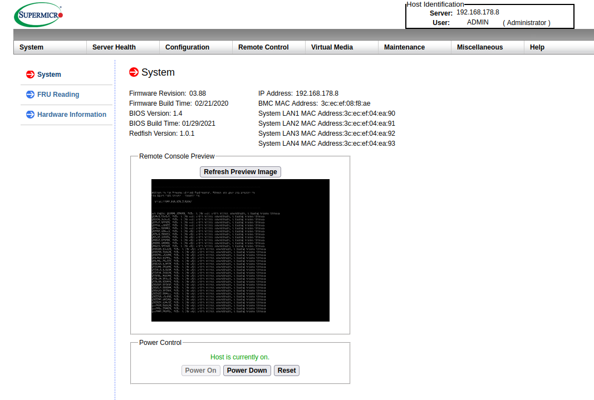
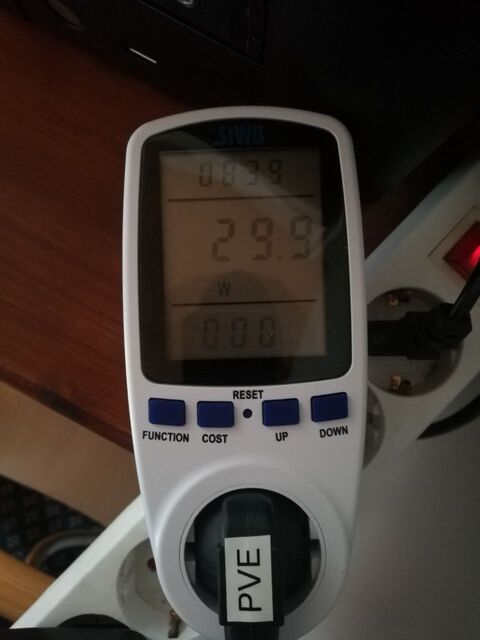

Ich möchte hier mal die Hardware meines Home Labs beschreiben.

Warnhinweis: kann Spuren von unbezahlter Werbung enthalten

## Anfangen! ⏳

Aber viel wichtiger ist es, wenn man Interesse an dem Thema Home Lab hat, einfach mal anzufangen und keine Zeit zu verlieren.
Es ist erst mal nicht wichtig, mit welcher Hardware man startet, man wird sie sehr wahrscheinlich sowieso nochmal anpassen, wenn man merkt, was seine Bedürfnisse sind.
Ich selbst hab mit einem alten gebrauchten Dell Optiplex 755 von Ebay angefangen. (Zugegeben vielleicht nicht die beste Wahl)
Man muss nicht warten bis man sich die all zu teure Hardware leisten kann.

## Mainboard

Beim Mainboard hab ich mich für ein [Supermicro A2SDi-4C-HLN4F](https://www.supermicro.com/en/products/motherboard/A2SDi-4C-HLN4F) entschieden.
Preis technisch war es kein Schnapper, aber ich hab auch zu einer Zeit gekauft, wo alles teuer war von daher
Die CPU ist auf dem Mainboard verankert, kann also nicht entfernt oder ausgewechselt werden. Die CPU ist ein Intel Atom C3558 und damit eine x86_64 Architektur.
Zugegeben mit 2.2GHz und 4 Kernen ist diese recht schwach. Aber auch hier haben meine Erfahrungen gezeigt, dass es für mich völlig ausreicht.
Natürlich auch hier wieder abhängig von den Diensten und Anzahl der Nutzer.

## RAM

In meinem Setup hab ich auch festgestellt, dsas ich immer knapp über 8GB brauche.
Darum hab ich mich für 16GB ECC Ram entschieden, so bleiben noch knapp genug Platz für Spielereihen aller Art.

### ECC

Es steht für Error Correction Code, bei jeder Brechung in einem Computer können Fehler entstehen, man spricht davon das Bits einfach umkehren (Bit-Flip).
Um diese Fehler zu vermeiden, gibt es diese Technologie des ECC. Die Grund Idee ist es aus einer Anzahl von Bits ein Paritäts Bit zu generieren, treten bei der Überprüfung dieses Bits Fehler auf so
kann der Fehler gefunden und korrigiert werden. Dies passiert dann im laufenden Betrieb, so kann es weder zu Abstürzen oder Datenverlust kommen.

Wie sehe ich, ob ich ECC RAM verbaut habe?
Unter Linux kann man folgenden Befehl verwenden:



# dmidecode 3.3

$ dmidecode --type 16
Getting SMBIOS data from sysfs.
SMBIOS 3.0.0 present.

Handle 0x0017, DMI type 16, 23 bytes
Physical Memory Array
Location: System Board Or Motherboard
Use: System Memory
Error Correction Type: Single-bit ECC
Maximum Capacity: 128 GB
Error Information Handle: Not Provided
Number Of Devices: 4


Braucht man ECC RAM?

Aus meiner Erfahrung macht das Verbauen von ECC RAM nur Sinn, wenn man Server aufbaut. Mein Gefühl würde mir auch sagen, dass es für den privaten Gebrauch ein wenig übertrieben ist. 🤓

## Ethernet Ports

Das Board verfügt über 4 Gigabit Anschlüsse. Welche es erlauben, auch mal ein einige Netzwerk Konfigurationen auszuprobieren.
Sprich das Testen von VLANs, Link Aggregation oder ein Port an eine bestimmte VM/Container weiterzuleiten. Sowie das Aufsetzen einer Firewall.

## IPMI

Was ist ein IPMI?

Der Begriff steht Intelligent Plattform Management Interface, es ermöglicht eine Fernwartung des Rechners, die außerhalb des Betriebssystem stattfindet.
Eine Art BIOS bloß, dass man den Rechner noch durch das Netzwerk steuern kann. Das geht auch wenn der Rechnern aus ist.
Dieses Management System hat bei unterschiedlichen Herstellern andere Namen, bei Dell ist es iDRAC, bei HP ist es iLO.

Hier ein Bild von meinem Supermicro IPMI:

Wichtig im Unternehmenskontext ist es, dies vom normalen Netzwerk zu separieren.
Weil es immer mal wieder zu Lücken in diesen Fernwartungssytemen kommt, zuletzt in [HPs iLO](https://www.heise.de/news/Rootkit-schluepft-durch-Luecke-in-HPEs-Fernwartung-iLO-6315714.html).

## Lautstärke 🔈

Lautstärke ist ja natürlich häufig Zuhause ein Thema, das Mainboard selbst hat keinen Lüfter verbaut.
Ich habe den Lüfter des Netzteils mit einen Noctua 40x20mm Lüfter getauscht.
Die Noctua Lüfter haben den Ruf, das sie besonders leise sind und ich muss sagen, dass ich doch recht zufrieden bin.

Da die Temperatur der CPU doch recht hoch war, habe ich im Gehäuse ein 120mm Noctua Lüfter verbaut.

apropos Gehäuse 🧐

## Gehäuse

Als Gehäuse verwende ich ein [INTER-TECH IPC SC-4004](https://www.amazon.de/INTER-TECH-IPC-SC-4004-HDD-EXT/dp/B01GZ1S7YI?__mk_de_DE=%C3%85M%C3%85%C5%BD%C3%95%C3%91&dchild=1&keywords=inter-tech+ipc+sc-4004&qid=1612880770&s=computers&sr=1-1&linkCode=sl1&tag=austriangamer-21&linkId=8b18d316b1dfa6ce39d1c28a95147ec7&language=de_DE&ref_=as_li_ss_tl).
Die generelle Verarbeitungsqualität ist recht schlecht, aber was mir gefällt, dass es die Möglichkeit bietet, vier 3,5 Zoll Festplatten unter zu bringen. Diese könnte man auch im Hot Plug Verfahren tauschen.
Ich verwende zurzeit nur zwei davon, womit ich auch schon beim nächsten Thema bin.

## Speicher 💾

Ich habe eine zwei SSDs in meinem System verbaut, eine mit 120 GB, diese ist für das Basis Betriebssystem beherbergt.
Die zweite hat ein Terabyte, hier werden alle VM/Container gespeichert.

Interessanter Command um Platten auszulesen:


$ lshw -class disk -short
H/W path Device Class Description
========================================================
/0/100/14/0 /dev/sda disk 1TB Samsung SSD 870
/0/100/14/1 /dev/sdb disk 120GB KINGSTON SV300S3


## Keine drehenden Platten 💿

Auf klassische Festplatten hab ich verzichtet in der Hoffnung, dass das System dann weniger Energie verbraucht, womit wir auch schon beim nächsten Thema währen.

## Strom ⚡

Leider ein großes Thema in Deutschland auch Hetzner hat seine Preise erhört, da der Strompreis gestiegen ist. [Golem Artikel](https://www.golem.de/news/hosting-hetzner-erhoeht-preise-teils-um-30-prozent-wegen-stromkosten-2201-162685.html)

Auch Zuhause sind das Kosten, die nicht außer acht gelassen werden dürfen.

Ich hab mal ein Messgerät an meinen Server gesteckt:

Ich komme auf einen durchschnittlichen Verbrauch von etwa 30 Watt.
Wenn man das mal in ein [Stromrechner](https://rechneronline.de/steckdose/stromkosten.php) wirft, kommt man auf ca. 80€ pro Jahr an Kosten.

## Interessante Hardware

Hier ein paar Rechner, die mir gerade für Anfänger aufgefallen sind:

- [Mini PC von Amazon](https://www.amazon.de/dp/B089SHG28D/ref=cm_sw_r_oth_api_glt_i_SHYRM4DDHAQPEYV6RF8V?psc=1)
- [Mini PC mit AMD Ryzen](https://store.minisforum.com/products/deskmini-um700-manjaro-linux?variant=42316758778101)
- [Minisforum PCs](https://store.minisforum.de/)
- [Intel Nuc](https://www.intel.de/content/www/de/de/products/details/nuc.html)
