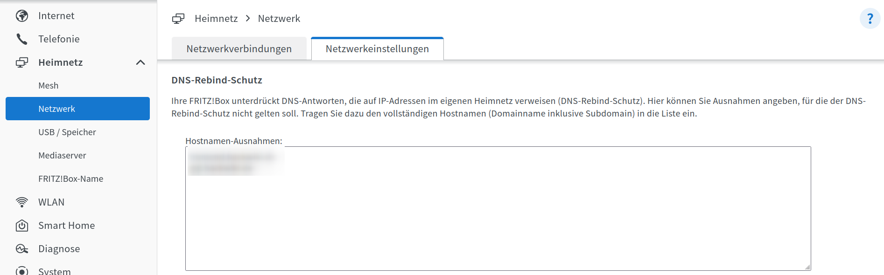

Seit einiger Zeit betreibe ich ein k3s Cluster und möchte nun meine Ingress Ressource erweitern,
um meine Anwendungen über gültige Let's Encrypt Zertifikate zu erreichen.
Die DNS Challenge für Let's Encrypt scheint mir hierfür die ideale Lösung zu sein,
da sie keine Öffnung von Ports nach außen erfordert und somit die Sicherheit meines Netzwerks nicht gefährdet.
In diesem Artikel zeige ich Ihnen Schritt für Schritt, wie Sie die DNS Challenge für Let's Encrypt in Ihrem k3s Cluster einrichten können,
wobei ich den DNS Provider Hetzner DNS verwende.

## Voraussetzungen 📋
  - k3s Cluster
    - kubectl
    - helm
  - DNS Provider (In meinem Fall Hetzner DNS, der Provider muss die API zur Verfügung stellen um die DNS Einträge zu ändern)

## Einrichtung des DNS Namens 📡
Zunächst müssen wir die DNS Einträge für unsere Domain erstellen. Diese Einträge können auf eine lokale IP Adresse zeigen.

Das ist im ersten moment vielleicht komisch da man annehmen könnte das sowas nicht funktioniert.
Und ja das birgt ein gewisses sicherheitsrisiko im DNS System. Diese Attacken heißen DNS-Rebinding-Angriff.
Als Angreifer könnte ich eine Domain auf eine lokale IP Adresse zeigen lassen und so versuchen auf die lokale IP Adresse zuzugreifen.
Es ist aber immer noch notwendig die Seite des Angreifers zu besuchen.
Daher gibt es bei den meisten Routern einen Rebound Schutz. Dieser verhindert das Anfragen von außen auf die lokale IP Adresse weitergeleitet werden. 

Sie müssen dies nun für ihre Domain im Router den Rebound Schutz deaktivieren. 
Bitte beachten Sie das sie dort nur ihre Domain eintragen wildcards könnten ein Sicherheitsrisiko darstellen.

Unter der Fritzbox finden sie den Rebound Schutz unter:

`Heimnetzwerk` -> `Netzwerk` -> `Netzwerkeinstellungen` -> `Rebound Schutz`

(Mir ist bewust das man die DNS Eintäge einsehen kann, trotzdem habe ich sie unkenntlich gemacht da sie hierfür nicht relevant sind.)

## Installation von cert-manager

Als nächstes müssen wir den cert-manager installieren, der quasi ein Standard in der Kubernetes Welt zur Verwaltung von Zertifikaten ist


kubectl apply -f https://github.com/cert-manager/cert-manager/releases/download/v1.14.4/cert-manager.yaml


Eine nicht ganz standardmäßige Komponente ist das Projekt [Cert Manager Webook Hetzner](https://github.com/vadimkim/cert-manager-webhook-hetzner), das die Kommunikation mit dem Hetzner DNS Provider ermöglicht.

Dafür verwenden wir helm, einen Paketmanager für Kubernetes:


helm repo add cert-manager-webhook-hetzner https://vadimkim.github.io/cert-manager-webhook-hetzner
helm install --namespace cert-manager cert-manager-webhook-hetzner cert-manager-webhook-hetzner/cert-manager-webhook-hetzner --set groupName=hackwiki.de


## Erstellen des Cluster Issuer
Um die DNS Challenge nutzen zu können, müssen wir einen Cluster Issuer erstellen.


---
apiVersion: cert-manager.io/v1
kind: ClusterIssuer
metadata:
    name: letsencrypt
spec:
    acme:
        server: https://acme-v02.api.letsencrypt.org/directory

        email: *************

        privateKeySecretRef:
            name: letsencrypt

        solvers:
            - dns01:
                  webhook:
                      groupName: **********
                      solverName: hetzner
                      config:
                          secretName: hetzner-secret
                          zoneName: *********
                          apiUrl: https://dns.hetzner.com/api/v1

Bei der Server-URL muss die Adresse des ACME Servers angegeben werden.
In der Readme des Projekts (Cert Manager Webhook Hetzner) finden Sie die URL für den Testserver.
Dies ist auch sinnvoll, wenn Sie beim Testen das Rate Limit von Let's Encrypt nicht überschreiten möchten.
Für Produktivsysteme sollten Sie die URL auf den normalen Let's Encrypt Server ändern.

Um mit dem Hetzner DNS Provider kommunizieren zu können, müssen wir den API-Key in einem Secret speichern.

---
apiVersion: v1
kind: Secret
metadata:
    name: hetzner-secret
    namespace: cert-manager
type: Opaque
data:
    api-key: ***************************


## Erstellen des Ingress

Bevor wir den Ingress erstellen, müssen wir noch ein Zertifikat erstellen.


---
apiVersion: cert-manager.io/v1
kind: Certificate
metadata:
    name: foobar-cert
    namespace: *********
spec:
    commonName: foobar.**********
    dnsNames:
        - foobar.**************
    issuerRef:
        name: letsencrypt
        kind: ClusterIssuer
    secretName: foobar-cert


Hier wird das Zertifikat für die Domain foobar.********** erstellt.

Nun können wir den Ingress erstellen.


---
apiVersion: networking.k8s.io/v1
kind: Ingress
metadata:
    name: foobar-ingress
    namespace: *******
    annotations:
        cert-manager.io/cluster-issuer: letsencrypt
spec:
    ingressClassName: traefik
    rules:
        - host: foobar.***********
        - http:
              paths:
                  - path: /
                    pathType: Prefix
                    backend:
                        service:
                            name: foobar-service
                            port:
                                number: 80
    tls:
        - hosts:
              - foobar.************
          secretName: foobar-cert


Der Ingress leitet nun alle Anfragen an die Domain `foobar.**********` an den Service `foobar-service` weiter.

## Fazit 🎉
Die Verwendung der DNS Challenge für Let's Encrypt bietet eine sehr sichere Methode zur Erlangung von Zertifikaten für Ihre Anwendungen.
Ich hoffe, dieser Post hat Ihnen geholfen, die DNS Challenge für Let's Encrypt in Ihrem k3s Cluster einzurichten.
