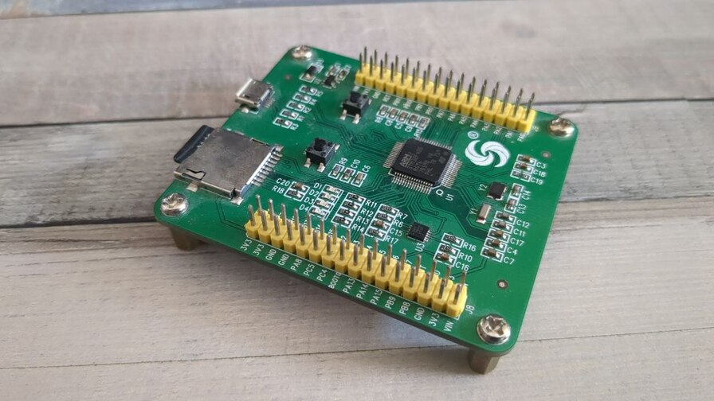
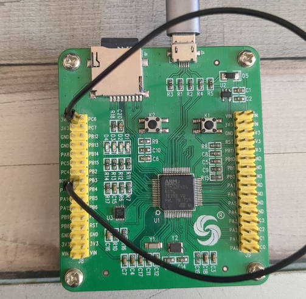

Hallo, in diesem Beitrag geht es um das flashen eines MicroPython Firmware auf einen China clone des PyBoard. Es handelt sich hierbei um den Clone mit dem STM32F405RGT6 Chip.

Heute nutzen wahrscheinlich die wenigsten noch dieses Board. ESP32 und RP2040 sind hier die weitaus bekannteren Verteter. 
Aber für leute die wie ich das Board besitzen und sich fragen wie sie eine neue firmware auf den chip flashen, habe ich hier ein kurzes How-To erstellt.

Die Hardware : 

Zum flashen des Firmware benötigen wir : 

- Das PyBoard Clone 
- Ein MicroUSB Kabel 
- Jumperkabel um den Boot Pin zu überbrücken

Um firmware überhaupt erst zu flashen benötigen wir das Programm `dfu-util`. Dieses ist auf vielen Linux Distributionen bereits in den o Paketquellen vorhanden. Kann einfach mit `sudo apt install dfu-util` installiert werden.

Nun müssen wir das Board in den sogenannten Bootloader Modus bringen. Hierfür müssen wir die beiden Boot Pins überbrücken. Hierzu eignen sich Jumperkabel oder ein Stück Draht. Dafür muss BOOT0 mit 3.3V verbunden werden. 

Nun müssen wir das Board per USB an unseren PC anschließen. `dfu-util` sollte in der Lage sein das Board zu erkennen. 

Nun können wir die Firmware die auf dem Board sichern. (Würde das auf jeden fall machen, ich habe diese Backup schon benötigt).


sudo dfu-util --alt 0 --upload pyboard-original.dat -s:524288


Für den Fall das du das Backup wieder einspielen musst/möchtest einfach: 


$ sudo dfu-util --alt 0 -D pyboard-original.dat -d 0483:df11 -s 0x8000000


Da die Firmware nicht für unser Board bereit steht auf der Micropython Webseite,
müssen wir diese selber kompilieren.
Hierfür benötigen wir `git`, `make` und `arm-none-eabi-gcc`.


sudo apt install git build-essential gcc-arm-none-eabi \
    libnewlib-arm-none-eabi \
    make python3 python3-pip \
    cmake ninja-build


Nun muss das Git Repo von Micropython heruntergeladen werden. 


git clone https://github.com/micropython/micropython
cd micropython
git submodule update --init --recursive


Nun muss `mpy-cross` kompiliert werden. Dieser dient dazu, Python Code in Maschienencode zu übersetzen.


cd mpy-cross
make
cd ..


Nun müssen die Submodule von Ports/STM32 herutergeladen werden. Hierfür müßen wir in den Ordner ports/stm32 wechseln. 


cd ports/stm32
make submodules


Nun müssen wir noch die Firmware kompilieren. Dafür verwenden wir den Befehl `make BOARD=PYBV3`. Wobei PYBV3 der Boardtyp ist.


make BOARD=PYBV3


Danach liegt im Ordner `micropython/ports/stm32/build-PYBV3/firmware.dfu` die Firmware. Dieses kann nun wieder geflasht werden.


sudo dfu-util --alt 0 -D firmware.dfu


Unser Board hat nun die aktuelle MicroPython Version laufen. 