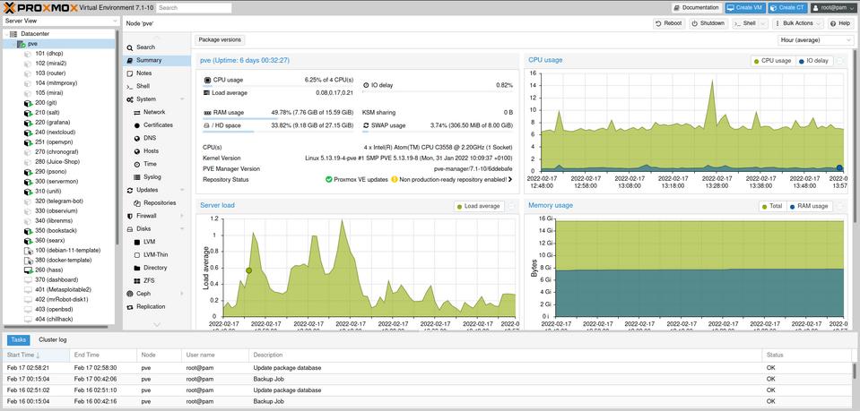
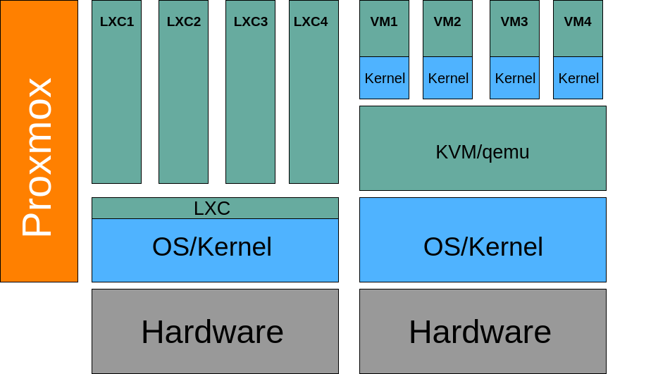

During my apprenticeship, I was supposed to deal with the topic of Proxmox.
But somehow this topic has also found its way into my private life. Now it even runs on my own hardware - a true miracle! 🤯

## Virtualization 🖥️
Virtualization offers numerous advantages:

  - **Better hardware utilization**: Existing hardware can be utilized more efficiently.
  - **Multiple operating systems on one host**: Various operating systems can run on a single host. Linux, Windows, BSD, etc.
  - **Separation of different task domains**: Isolated environments for different purposes.
  - **Improved handling in emergencies**: Faster disaster recovery.
  - **Increased availability**: Through failover mechanisms and high availability solutions.
  - **Centralized management and control**: Easy management of multiple virtual machines.
  - **Fault and security isolation**: Issues in one VM do not affect others.
  - **Migration of VMs to any host**: Flexibility in resource utilization.

## About Proxmox Server Solutions GmbH 🏢
Proxmox Server Solutions GmbH is an Austrian company that offers three main products:

  - **Proxmox Virtual Environment**: Our topic today.
  - **Proxmox Mail Gateway**
  - **Proxmox Backup Server**

## Subscription model 📜
Although Proxmox is an open-source solution and can be operated without license costs, the company offers a four-tier subscription model.
This provides access to a repository with extra-tested packages as well as different levels of support depending on the subscription tier.
While this may not be necessary for individual users, it provides additional security and support for medium to large enterprises.

## System requirements 📋
To operate your own Proxmox environment, certain requirements must be met:

  - **CPU**: 64-bit (Intel EMT64 or AMD64)
  - **Memory**: At least 1 GB RAM, plus the RAM used by the guest systems
  - **Hard disk**: At least 3 GB of free space
  - **A network card with a static IP address**

## Installation ✨
The installation of Proxmox is very similar to a normal Linux installation, as it is based on Debian.
It's important to assign a static IP address during installation.

## Web interface 🌐
After a successful installation, you will be greeted by the clear web interface of Proxmox.
Note that HTTPS and port 8006 must be used: `https://<Static IP>:8006`

On the left side, virtual machines and containers are listed.
Clicking on a machine provides further information.

## Containers vs VMs

Containers and VMs are two different types of virtualization.
Containers are lightweight and share the host's kernel, while VMs are more isolated and have their own kernel.

### LXC (Linux Containers) 📦
LXC is an operating-system-level virtualization method for running multiple isolated Linux systems on a single host.
It's similar to a chroot, but offers much more isolation.

Some highlights that make LXC special:
  - Suitable only for Linux
  - Lower RAM requirements
  - Some security concerns
  - No built-in snapshots
  - No live migration

### KVM (Kernel-based Virtual Machine) 🖥️
KVM is a full virtualization solution for Linux on x86 hardware containing virtualization extensions (Intel VT or AMD-V).

Some highlights that make KVM special:
  - Can host any operating system
  - Higher RAM requirements
  - Fewer security concerns
  - Built-in snapshots
  - Live migration possible

## Cluster 🤝
Proxmox VE can be clustered to provide high availability and load balancing to virtual machines and containers.
This is done by combining multiple Proxmox VE servers into a cluster.

## Network 🌐
Proxmox supports various network configurations, including classic Linux configurations as well as Open vSwitch (OVS).

## Storage 💾
Proxmox supports various storage types, including local storage, network storage, and distributed storage. 
This connections are possible, including CIFS, NFS, iSCSI, and Ceph.

  - **CIFS**: Proxmox supports SMB Version 2 and 3. But it is described as slow.
  - **NFS**: All NFS (Network File System) versions are supported. The fourth is said to be the fastest. I find it simple, fast, and practical.
  - **iSCSI**: For iSCSI, there are two ways to set it up:
    - The first is to pass the LUN (Logical Unit Number) to the VMs.
    - The second way is to include the ISCSI and then format it in LVM, ZFS, or Directory. This is more complex.
  - **Ceph**: Ceph is a distributed file system based on object storage. It is very complex and is used more in large environments.

## Migration from ESXi 🚚
Proxmox VE provides a tool to migrate virtual machines from VMware ESXi to Proxmox VE.
This is done by converting the VMWare virtual disk to a Proxmox compatible format.

1. Copy `.vmdk` files to Proxmox
2. Convert `.vmdk` files to `qcow2` format: `qemu-img convert -f vmdk ten4sg.vmdk -O qcow2 /var/lib/vz/images/123/ten4sg`
3. Create VM preferably in the web interface
4. Attach with: `qm importdisk 123 ten4sg local-1-HDD --format qcow2`
5. Mount and delete old disk also in the web interface.

I have written a script that downloads VMs from [vulnhub](https://www.vulnhub.com/)
and imports them into Proxmox.
It is called [vuln2pve](https://github.com/53845714nF/vuln2pve). This uses similar techniques. Since the VMs on Vulnhub are usually available in different formats, these are also converted.

Additional note 26.03.2024: Proxmox has now also released a tool that makes it easier to migrate from ESXi to Proxmox. [Proxmox Wiki](https://pve.proxmox.com/wiki/Migrate_to_Proxmox_VE#Automatic_ESXi_Import:_Step_by_Step)

## API 🤖
Proxmox offers an API that allows Proxmox to be controlled via a script. 
This is particularly interesting for larger environments. There is also a `Terraform` provider for this API.

## App 📱
There is also an app for Proxmox. This allows you to manage your Proxmox environment from your smartphone. 
It's quite useful for checking how the machines are running, but I rarely use it otherwise.
