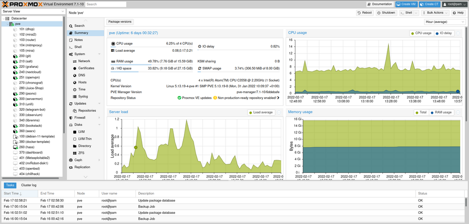
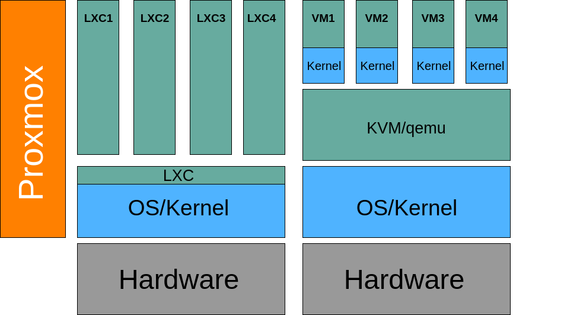

Während meiner Ausbildung sollte ich mich mit dem Thema Proxmox auseinandersetzen.
Doch irgendwie hat dieses Thema auch privat bei mir Einzug gehalten. Nun läuft es sogar auf meiner eigenen Hardware – ein wahres Wunder! 🤯

## Virtualisierung 🖥️
Die Virtualisierung bietet zahlreiche Vorteile:

  - **Bessere Auslastung der Hardware**: Existierende Hardware kann effizienter genutzt werden.
  - **Mehrere Betriebssysteme auf einem Host**: Verschiedene Betriebssysteme können auf einem einzigen Host ausgeführt werden. Linux, Windows, BSD, etc.
  - **Trennung verschiedener Aufgabenbereiche**: Isolierte Umgebungen für unterschiedliche Zwecke.
  - **Verbessertes Handling bei Notfällen**: Schnellere Wiederherstellung (Desaster Recovery).
  - **Erhöhung der Verfügbarkeit**: Durch Failover-Mechanismen und Hochverfügbarkeitslösungen.
  - **Zentralisierte Verwaltung und Kontrolle**: Einfache Verwaltung mehrerer virtueller Maschinen.
  - **Fehler- und Sicherheitsisolation**: Probleme in einer VM beeinträchtigen andere nicht.
  - **Migrieren von VMs auf beliebige Hosts**: Flexibilität bei der Ressourcennutzung.

## Über Proxmox Server Solutions GmbH  🏢
Die Proxmox Server Solutions GmbH ist ein österreichisches Unternehmen, das drei wesentliche Produkte anbietet:

  - **Proxmox Virtual Environment**: Unser heutiges Thema.
  - **Proxmox Mail Gateway**
  - **Proxmox Backup Server**

## Abo-Modell 📜
Obwohl Proxmox eine Open-Source-Lösung ist und ohne Lizenzkosten betrieben werden kann, bietet das Unternehmen ein vierstufiges Abonnementmodell an.
Dieses bietet Zugriff auf ein Repository mit extra getesteten Paketen sowie unterschiedlichen Support je nach Abonnementsstufe.
Während dies für Privatnutzer möglicherweise nicht erforderlich ist, bietet es mittleren bis großen Unternehmen zusätzliche Sicherheit und Unterstützung.

## Systemanforderungen 📋
Um eine eigene Proxmox-Umgebung zu betreiben, müssen bestimmte Anforderungen erfüllt sein:

  - **CPU**: 64-Bit (Intel EMT64 oder AMD64)
  - **Arbeitsspeicher**: Mindestens 1 GB RAM, zuzüglich des RAMs, der von den Gastsystemen verwendet wird
  - **Festplatte**: Mindestens 3 GB freier Speicherplatz
  - **Eine Netzwerkkarte mit statischer IP-Adresse**

## Installation ✨
Die Installation von Proxmox ähnelt stark einer normalen Linux-Installation, da es auf Debian basiert.
Wichtig ist, während der Installation eine statische IP-Adresse zuzuweisen.

## Webinterface 🌐
Nach der erfolgreichen Installation begrüßt Sie das übersichtliche Webinterface von Proxmox.
Beachten Sie, dass HTTPS und der Port 8006 verwendet werden müssen: `https://<Statische IP>:8006 `

Auf der linken Seite sind die virtuellen Maschinen und Container aufgelistet.
Ein Klick auf eine Maschine liefert weitere Informationen.

## Container vs VMs

Die Virtualisierung mit Proxmox kann entweder auf Container- oder auf VM-Ebene erfolgen.

### LXC (Container) 📦
Eine kurze Auflistung die LXC besonders machen:
  - Nur für Linux geeignet
  - Geringerer RAM-Bedarf
  - Teilweise Sicherheitsbedenken
  - Keine eingebauten Snapshots
  - Keine Live-Migration

### KVM (VMs)🖥️
Sind klassische WMs
  - Kann alle Betriebssysteme hosten
  - Höherer RAM-Bedarf
  - Weniger Sicherheitslücken
  - Eingebaute Snapshots
  - Live-Migration möglich

## Cluster 🤝
Proxmox ermöglicht die Einrichtung von Clustern, um Ressourcen zu teilen und Ausfallsicherheit zu gewährleisten.
Dies ist besonders für Unternehmen interessant, die eine hohe Verfügbarkeit (englisch high availability, HA) benötigen.

## Netzwerke 🌐
Proxmox unterstützt verschiedene Netzwerkkonfigurationen, darunter klassische Linux-Konfigurationen sowie Open vSwitch (OVS).

## Speicher 💾
Verschiedene Speicheranbindungen sind möglich, darunter `CIFS`, `NFS`, `iSCSI` und `Ceph`.

  - **CIFS**:Proxmox unterstützt SMB Version 2 und 3. Es wird aber als langsam beschrieben.
  - **NFS**: Es werden alle NFS (Network File System) Versionen unterstützt. Die vierte soll am schnellsten sein. Ich finde es einfach, schnell und praktisch.
  - **ISCSI**: Bei ISCSI gibt es zwei Wege dies einzurichten:
    - Der erste ist, die LUN (Logical Unit Number) an die VMs durch zu reichen.
    - Der zweite Weg ist es das ISCSI einzubinden und dann im LVM, ZFS oder Directory zu formatieren. Dies ist aufwändiger.
  - **Ceph**: Ceph ist ein verteiltes Dateisystem, das auf Objektspeicher basiert. Es ist sehr komplex und wird eher in großen Umgebungen eingesetzt.

## Migration von ESXi 🚚
Ein Punkt, der auch selten für Privat Anwender interessant ist. Aber ab und zu kommt es vor, dass Dienste, die man betreiben möchte als virtuelle Appliances zur Verfügung stehen.
Diese muss man dann umwandeln. Hier eine kurzer Ablauf:

1. `.vmdk` Dateien kopieren zum Proxmox 
2. Die `.vmdk` Dateien in `qcow2` Format umwandeln:
`qemu-img convert -f vmdk ten4sg.vmdk -O qcow2 /var/lib/vz/images/123/ten4sg`
3. VM erstellen am Besten im Webinterface
4. Einbinden mit:`qm importdisk 123 ten4sg local-1-HDD --format qcow2 `
5. Einhängen und alte Platte löschen auch im Webinterface.

Ich habe ein Script geschrieben, welches VMs von [vulnhub](https://www.vulnhub.com/)
herunterlädt und in Proxmox importiert. 
Es heißt [vuln2pve](https://github.com/53845714nF/vuln2pve). Dies bedient sich ähnlicher technicken. Da auf Vulnhub die VMs meistens im verschiedenen Formaten vorliegen, werden diese auch umgewandelt.

Ergänzung 26.03.2024: Proxmox hat nun auch ein Tool veröffentlicht, welches die Migration von ESXi zu Proxmox erleichtert. [Proxmox Wiki](https://pve.proxmox.com/wiki/Migrate_to_Proxmox_VE#Automatic_ESXi_Import:_Step_by_Step)

## API 🤖
Proxmox bietet eine API an, die es ermöglicht, Proxmox über ein Skript zu steuern.
Das ist besonders für größere Umgebungen interessant. Gibt auch ein `Terraform` Provider für diese API.

## App 📱
Proxmox bietet eine App, mit der man auch per Smartphone sein Proxmox Instanz administrieren kann.
Ist recht gut, um mal zu gucken, ob und wie die Maschinen laufen, sonst verwende ich sie eher selten.