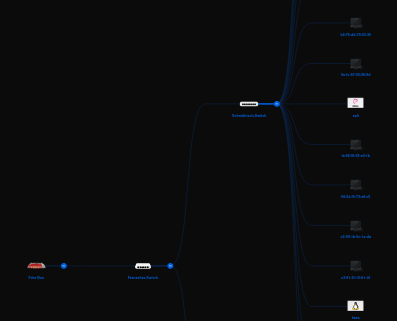
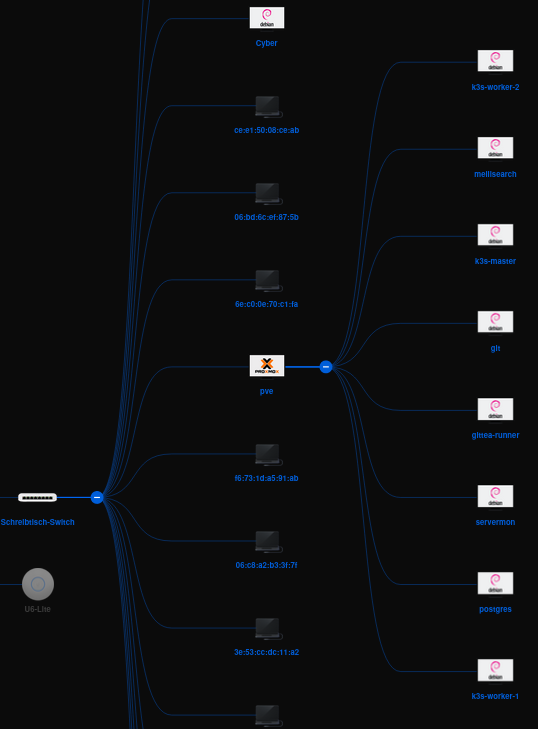

I've been using Proxmox and Unifi in my network.
Anyone who uses Unifi is likely familiar with the Unifi Map.

## Issue with the Map ⚠️
When opening the map in the regular Unifi Controller, you'll notice that all devices on the network are displayed.
Unfortunately, the virtual machines from Proxmox are also shown there, as if they were standalone devices.

I've always found this somewhat bothersome, but I never took the time to change it.
The effort versus the benefit just didn't seem worth it to me.
However, recently, I came across a solution in a forum on how to change this so that the virtual machines are displayed on the map behind the Proxmox host.

## Solution to the Issue 🛠️
It's important to know that Unifi detects devices based on LLDP (Link Layer Discovery Protocol).
LLDP is a network protocol that allows for gathering and distributing information about directly connected devices.
It's often used to read neighborhood information from network devices.

On all VMs and LXC containers running on the Proxmox host, the `lldpd` package must be installed. This can be achieved with the following command:


apt install lldpd


Alternatively, I've chosen to write a Salt State that installs the package on all VMs and LXC containers:


install_lldpd:
  pkg.installed:
    - name: lldpd


This automation makes it easy for me to ensure that all my machines have a running LLDP daemon.

Another issue was that all VMs and LXC containers are connected to a Linux bridge. This bridge filters the LLDP packet and doesn't forward it. However, there is a solution, which is detailed here: [MAC Bridge Filtered MAC Group Addresses](https://interestingtraffic.nl/2017/11/21/an-oddly-specific-post-about-group_fwd_mask/)

In short, you need to run `echo 16384 > /sys/class/net/vmbr0/bridge/group_fwd_mask`, replacing `vmbr0` with the appropriate bridge. I also installed `lldpd` on the Proxmox host, which is important.

## Result 🎉
After a few minutes, the map in the Unifi Controller should update and display the VMs and LXC containers behind the Proxmox host.

This is, of course, just a small detail, but I find it makes the map in the Unifi Controller much more organized. However, I've noticed that this isn't a 100% solution. Sometimes, the VMs and LXC containers are still shown as separate devices.