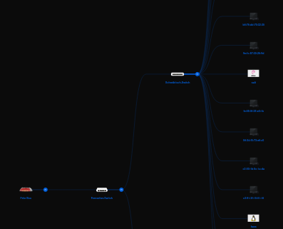
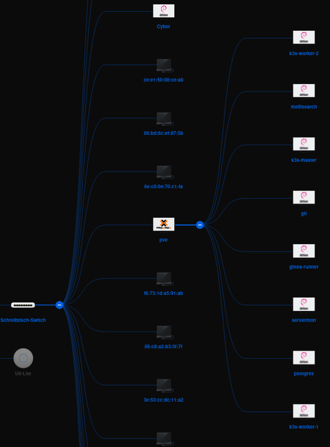


Die hier gezeigte Methode ist nicht so Stabil. Teilweise verschieben sich Maschinen. Zu Beginn muss häufig der Unifi Controller neu gestartet werden.


Seit einiger Zeit nutze ich Proxmox und Unifi in meinem Netzwerk.
Wer ebenfalls auf Unifi setzt, dürfte mit der Unifi Map vertraut sein.

## Problem mit der Karte ⚠️
Beim Öffnen der Karte im herkömmlichen Unifi Controller fällt auf,
dass alle Geräte im Netzwerk angezeigt werden.
Leider werden auch die virtuellen Maschinen von Proxmox dort angezeigt, als wären sie eigenständige Geräte.

Das hat mich schon immer gestört, aber ich habe mir nie die Zeit genommen, es zu ändern.
Der Aufwand schien mir im Vergleich zum Nutzen einfach zu gering.
Kürzlich bin ich jedoch in einem Forum auf eine Lösung gestoßen, wie man das ändern kann,
sodass die virtuellen Maschinen auf der Karte hinter dem Proxmox-Host angezeigt werden.

## Lösung des Problems 🛠️
Es ist wichtig zu wissen, dass Unifi die Geräte anhand von LLDP (Link Layer Discovery Protocol) erkennt.
LLDP ist ein Netzwerkprotokoll, das es ermöglicht, Informationen über direkt verbundene Geräte zu sammeln und zu verteilen.
Häufig wird es verwendet, um die Nachbarschaftsinformationen von Netzwerkgeräten auszulesen.

Auf allen VMs und LXC-Containern, die auf dem Proxmox-Host laufen, muss das Paket `lldpd` installiert sein.
Dies kann mit folgendem Befehl erreicht werden:


apt install lldpd


Alternativ habe ich mich dazu entschieden, einen Salt State zu schreiben,
der das Paket auf allen VMs und LXC-Containern installiert:


install_lldpd:
  pkg.installed:
    - name: lldpd


Diese Automatisierung erleichtert es mir, sicherzustellen, dass alle meine Maschinen einen laufenden LLDP-Daemon haben.

Sehr hilfreicher command: 

lldpcli show neighbors


Ein weiteres Problem bestand darin, dass alle VMs und LXC-Container an einer Linux Bridge hängen. Diese filtert das LLDP-Paket und leitet es nicht weiter. Es gibt jedoch eine Lösung, die hier ausführlich beschrieben wird: [MAC Bridge Filtered MAC Group Addresses](https://interestingtraffic.nl/2017/11/21/an-oddly-specific-post-about-group_fwd_mask/)

Kurz gesagt, muss man `echo 16384 > /sys/class/net/vmbr0/bridge/group_fwd_mask` ausführen, wobei `vmbr0` durch die entsprechende Bridge ersetzt werden muss.
Auf dem Proxmox-Host habe ich auch `lldpd` installiert, was wichtig ist.

## Ergebnis 🎉
Nach einigen Minuten sollte sich die Karte im Unifi Controller aktualisieren und die VMs und LXC-Container hinter dem Proxmox-Host anzeigen.

Dies ist natürlich nur ein kleines Detail, aber ich finde, es macht die Karte im Unifi Controller viel übersichtlicher.
Ich habe jedoch festgestellt, dass dies keine 100%ige Lösung ist.
Manchmal werden die VMs und LXC-Container immer noch als separate Geräte angezeigt.
