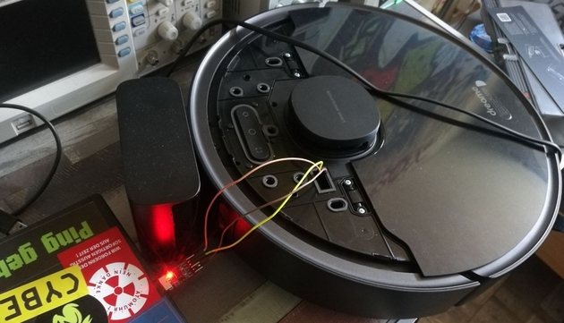

Ich möchte über Valetudo schreiben, eine Open-Source-Firmware für Staubsauger-Roboter.
Viele dieser Geräte sind mit Netzwerksniffern ausgestattet, die die gesammelten Daten an Server in China übertragen.
Valetudo versucht, dies zu unterbinden, weshalb ich froh bin, dass es dieses Projekt gibt.

Ich habe mir einen Dreamy Bot L10 Pro zugelegt und die Installation gemäß dieser [Anleitung](https://valetudo.cloud/pages/installation/dreame.html#uart) durchgegangen.
durchgeführt.

Hier ein Bild der Installation:

ine weitere interessante Software ist eine [Erweiterung](https://github.com/Hypfer/lovelace-valetudo-map-card)
für [Home Assistant](https://www.home-assistant.io/)
Diese Erweiterung ermöglicht es, die Karten, die beim Saugen entstehen,
anzuzeigen, Steuerbefehle abzusetzen und den Ladezustand sowie den Batterieverbrauch zu überwachen.

