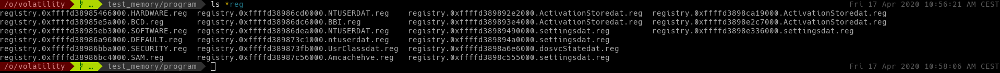
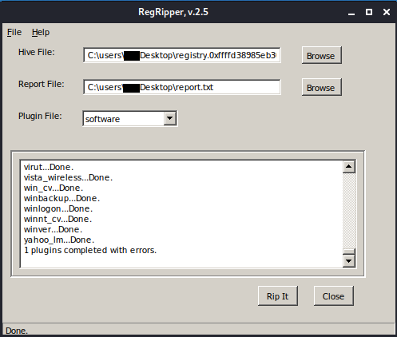
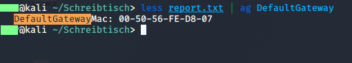
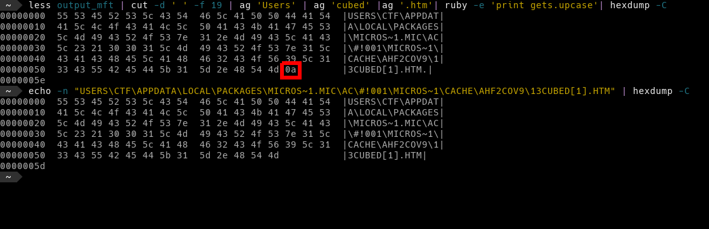
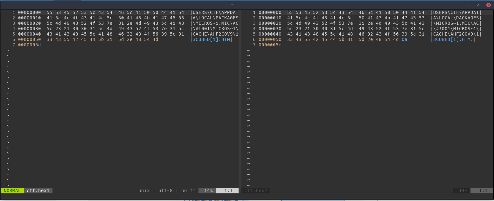

CTF steht für Capture the Flag, Ziel des Spieles ist es alle Flaggen zu bekommen, das CTF bestand aus einer Memory Datei sowie 4
Fragen/Aufgaben, welche als Flaggen fungierten.

Das Mini Memory CTF stammt von dem Youtuber 13Cube, die Idee ist es den
Umgang mit volatility oder anderen Memory Analyse Werkzeugen spielerisch
zu lernen.

[Link zu Ankündigungsvideo](https://www.youtube.com/watch?v=JuEv8UleO0U&t=)

[Aufgaben und Lösungen des CTF](img/mini_memory_ctf_solutions_guide.pdf)

#### Flagge Nummer 1:

Welcher laufende Prozess ist bösartig? Nennen sie den Md5 Hash der
Prozess Id.

Die allgegenwärtige Windows svchost.exe ist ein beliebter Prozess, um
Malware zu verstecken. Ein normales System hat viele dieser
`svshost.exe` Prozesse am Laufen. Dieser ist immer ein Kindprozess von
servives.exe und liegt in dem Verzeichnis: %SYSTEMROOT%  System32 .

Als erstes führen wir diesen Command aus: `vol -f /opt/volatility/test_memory/ctf/memdump.mem --profile=Win10x64_15063 psscan | grep -i svchost`

Es wird das Profil Win10x64_15063 benutzt, zudem nutzen wir das Plugin `psscan`, welches ähnlich zu `pslist` ist. Jedoch offenbart uns `psscan`
auch Prozesse, die im Hintergrund laufen. Des weiteren filtern wir auch nach svchost.


    Volatility Foundation Volatility Framework 2.6.1
    0x0000a780001d6080 svchost.exe        5048    804 0x000000003c400002 2018-08-01 19:21:00 UTC+0000
    0x0000c20c6a5514c0 svchost.exe        8808    804 0x0000000079000002 2018-08-06 18:12:05 UTC+0000
    0x0000c20c6aa0d580 svchost.exe        8052    804 0x00000000a5c09002 2018-08-06 18:12:40 UTC+0000
    0x0000c20c6aaf9080 svchost.exe        1992    804 0x0000000006500002 2018-08-06 18:12:01 UTC+0000
    0x0000c20c6ab2b580 svchost.exe.ex     6176   4824 0x000000004d100002 2018-08-01 19:52:19 UTC+0000   2018-08-01 19:52:19 UTC+0000
    0x0000c20c6ab70080 svchost.exe        8852   4824 0x0000000096f00002 2018-08-01 19:59:49 UTC+0000   2018-08-01 20:00:08 UTC+0000
    0x0000c20c6b4c6080 svchost.exe        5048    804 0x000000003c400002 2018-08-01 19:21:00 UTC+0000
    0x0000c20c6b513580 svchost.exe        5264    804 0x00000000b8950002 2018-08-01 19:21:11 UTC+0000
    0x0000c20c6b585580 svchost.exe        3224    804 0x0000000078e00002 2018-08-01 19:43:30 UTC+0000
    0x0000c20c6b5b6580 svchost.exe        4040    804 0x00000000b9770002 2018-08-01 19:21:04 UTC+0000
    0x0000c20c6b6a5580 svchost.exe        2020    804 0x0000000023b00002 2018-08-01 19:20:54 UTC+0000
    0x0000c20c6b6b5580 svchost.exe        4304    804 0x000000002d400002 2018-08-01 19:20:55 UTC+0000
    0x0000c20c6b6c3580 svchost.exe        4132    804 0x0000000028b00002 2018-08-01 19:20:54 UTC+0000
    0x0000c20c6b8dd580 svchost.exe         924    804 0x000000010e410002 2018-08-01 19:20:28 UTC+0000
    0x0000c20c6b8df580 svchost.exe         904    804 0x000000010ba10002 2018-08-01 19:20:28 UTC+0000
    0x0000c20c6ba17580 svchost.exe         628    804 0x0000000110d10002 2018-08-01 19:20:28 UTC+0000
    0x0000c20c6ba39580 svchost.exe        1020    804 0x0000000110930002 2018-08-01 19:20:28 UTC+0000
    0x0000c20c6ba9f080 svchost.exe         476    804 0x0000000112620002 2018-08-01 19:20:29 UTC+0000
    0x0000c20c6bad9580 svchost.exe        1196    804 0x0000000111f20002 2018-08-01 19:20:29 UTC+0000
    0x0000c20c6bae1580 svchost.exe        1072    804 0x0000000110f20002 2018-08-01 19:20:29 UTC+0000
    0x0000c20c6bae3580 svchost.exe        1056    804 0x0000000112ed0002 2018-08-01 19:20:29 UTC+0000
    0x0000c20c6bae5580 svchost.exe        1040    804 0x0000000112f00002 2018-08-01 19:20:29 UTC+0000
    0x0000c20c6bae9580 svchost.exe         800    804 0x0000000112610002 2018-08-01 19:20:29 UTC+0000   2018-08-06 18:11:48 UTC+0000
    0x0000c20c6bb8e580 svchost.exe        1296    804 0x0000000113180002 2018-08-01 19:20:30 UTC+0000
    0x0000c20c6bb9a580 svchost.exe        1392    804 0x0000000116a50002 2018-08-01 19:20:30 UTC+0000
    0x0000c20c6bb9c580 svchost.exe        1384    804 0x0000000116b20002 2018-08-01 19:20:30 UTC+0000
    0x0000c20c6bbf2580 svchost.exe        1480    804 0x0000000115ba0002 2018-08-01 19:20:30 UTC+0000
    0x0000c20c6bbf4580 svchost.exe        1472    804 0x0000000115b70002 2018-08-01 19:20:30 UTC+0000
    0x0000c20c6bc35580 svchost.exe        1632    804 0x00000001169d0002 2018-08-01 19:20:30 UTC+0000
    0x0000c20c6bc3b580 svchost.exe        1600    804 0x0000000116910002 2018-08-01 19:20:30 UTC+0000
    0x0000c20c6bc3d580 svchost.exe        1592    804 0x00000001189c0002 2018-08-01 19:20:30 UTC+0000
    0x0000c20c6bc3f580 svchost.exe        1576    804 0x0000000118960002 2018-08-01 19:20:30 UTC+0000
    0x0000c20c6bc41580 svchost.exe        1568    804 0x0000000118810002 2018-08-01 19:20:30 UTC+0000
    0x0000c20c6bca52c0 svchost.exe        1608    804 0x0000000116930002 2018-08-01 19:20:30 UTC+0000
    0x0000c20c6bcc9580 svchost.exe        1692    804 0x0000000119160002 2018-08-01 19:20:31 UTC+0000
    0x0000c20c6bcd1400 svchost.exe        2888    804 0x0000000097500002 2018-08-01 19:24:32 UTC+0000   2018-08-01 19:24:38 UTC+0000


Wir können sehen, die Mehrheit der Prozesse, hat die PID 804 als Elternprozess, dies ist auch völlig in Ordnung. Wenn wir ein wenig
gucken, kriegen wir heraus, dass es sich hierbei um die service.exe handelt. Doch was ist mit den Prozess mit der PID 4824?

Grepen wir nach der der 4824: `vol -f /opt/volatility/test_memory/ctf/memdump.mem --profile=Win10x64_15063 psscan | grep -i 4824`


    Volatility Foundation Volatility Framework 2.6.1
    0x0000c20c69cfe580 explorer.exe       4824   4756 0x0000000035800002 2018-08-01 19:20:58 UTC+0000
    0x0000c20c6a959580 FTK Imager.exe     3328   4824 0x000000005dd00002 2018-08-06 18:13:14 UTC+0000
    0x0000c20c6ab2b580 svchost.exe.ex     6176   4824 0x000000004d100002 2018-08-01 19:52:19 UTC+0000   2018-08-01 19:52:19 UTC+0000
    0x0000c20c6ab70080 svchost.exe        8852   4824 0x0000000096f00002 2018-08-01 19:59:49 UTC+0000   2018-08-01 20:00:08 UTC+0000
    0x0000c20c6ab92580 ByteCodeGenera     6532   4824 0x000000004c200002 2018-08-01 19:50:42 UTC+0000   2018-08-01 19:50:42 UTC+0000
    0x0000c20c6abeb580 notepad.exe        1412   4824 0x0000000056000002 2018-08-06 18:12:15 UTC+0000   2018-08-06 18:12:17 UTC+0000
    0x0000c20c6b588580 ie4uinit.exe       5716   4824 0x00000000bc500002 2018-08-01 19:21:30 UTC+0000   2018-08-01 19:21:31 UTC+0000
    0x0000c20c6c095580 MSASCuiL.exe       6268   4824 0x000000009ad00002 2018-08-01 19:21:56 UTC+0000
    0x0000c20c6cdf4580 scvhost.exe         360   4824 0x000000006af00002 2018-08-01 19:56:45 UTC+0000   2018-08-06 18:12:03 UTC+0000
    0x0000c20c6cfb1580 OneDrive.exe       2200   4824 0x00000000ba600002 2018-08-01 19:22:10 UTC+0000
    0x0000c20c6cfc2580 vmtoolsd.exe       3372   4824 0x0000000097700002 2018-08-01 19:21:56 UTC+0000
    0x0000c20c6d0d2080 Bubbles.scr       10204   4824 0x0000000047700002 2018-08-01 19:50:33 UTC+0000   2018-08-01 19:50:38 UTC+0000
    0x0000c20c6d36c080 scvhost.exe.ex      336   4824 0x000000004a100002 2018-08-01 19:52:31 UTC+0000   2018-08-01 19:52:31 UTC+0000
    0x0000c20c6d4d2080 dxdiag.exe         6324   4824 0x00000000a1900002 2018-08-01 19:51:18 UTC+0000   2018-08-01 19:51:28 UTC+0000
    0x0000c20c6d510080 notepad - Copy     6372   4824 0x0000000109000002 2018-08-01 20:10:32 UTC+0000   2018-08-01 20:10:32 UTC+0000
    0x0000c20c6d5ac340 svchost.exe.ex     5528   4824 0x0000000119400002 2018-08-01 19:52:20 UTC+0000   2018-08-01 19:52:20 UTC+0000
    0x0000c20c6d694080 notepad - Copy     3504   4824 0x000000001ea00002 2018-08-01 20:10:37 UTC+0000   2018-08-01 20:10:37 UTC+0000
    0x0000c20c6d6fc580 svchost.exe       10012   4824 0x0000000136200002 2018-08-01 19:49:19 UTC+0000   2018-08-01 19:49:19 UTC+0000
    0x0000c20c6d732080 notepad.exe        9128   4824 0x0000000069500002 2018-08-01 20:05:10 UTC+0000   2018-08-01 20:05:12 UTC+0000
    0x0000c20c6d789580 Bubbles.scr        6948   4824 0x000000011d400002 2018-08-01 19:50:30 UTC+0000   2018-08-01 19:50:31 UTC+0000
    0x0000c20c6d82e080 svchost.exe        1404   4824 0x00000000a0f00002 2018-08-01 19:54:55 UTC+0000   2018-08-01 19:56:35 UTC+0000
    0x0000c20c6d86b080 cmd.exe            3884   4824 0x0000000047100002 2018-08-01 19:37:47 UTC+0000
    0x0000c20c6d99b580 svchost.exe.ex     8140   4824 0x00000000b8600002 2018-08-01 19:52:16 UTC+0000   2018-08-01 19:52:16 UTC+0000
    0x0000c20c6daf9580 notepad.exe        7968   4824 0x000000001bb00002 2018-08-01 19:57:10 UTC+0000   2018-08-01 19:57:10 UTC+0000
    0x0000c20c6dbc5340 svchost.exe        7852   4824 0x000000003ff00002 2018-08-01 19:49:21 UTC+0000   2018-08-01 19:49:22 UTC+0000
    0x0000c20c6ddad580 svchost.exe        8560   4824 0x00000000b2200002 2018-08-01 20:13:10 UTC+0000
    0x0000c20c6e0bf580 scvhost.exe.ex     3016   4824 0x0000000137f00002 2018-08-01 19:52:29 UTC+0000   2018-08-01 19:52:29 UTC+0000
    0x0000c20c6e24f580 xwizard.exe         252   4824 0x000000010be00002 2018-08-01 19:51:52 UTC+0000   2018-08-01 19:51:55 UTC+0000
    0x0000c20c6e495080 cmd.exe            8868   4824 0x000000005ff00002 2018-08-01 19:40:14 UTC+0000   2018-08-01 19:49:18 UTC+0000
    0x0000c20c6e5ca200 notepad.exe        8800   4824 0x0000000024400002 2018-08-01 20:10:19 UTC+0000   2018-08-01 20:10:21 UTC+0000


Gleich in der ersten Zeile sehen wir, dass die 4824 die `explorer.exe` ist, diese hat jedoch nicht die Aufgabe eine svchost.exe auszuführen.

Nun suchen wir nach der 4824 und svchost: `vol -f /opt/volatility/test_memory/ctf/memdump.mem --profile=Win10x64_15063 psscan | grep -i 4824 | grep svchost`


    Volatility Foundation Volatility Framework 2.6.1
    0x0000c20c6ab2b580 svchost.exe.ex     6176   4824 0x000000004d100002 2018-08-01 19:52:19 UTC+0000   2018-08-01 19:52:19 UTC+0000
    0x0000c20c6ab70080 svchost.exe        8852   4824 0x0000000096f00002 2018-08-01 19:59:49 UTC+0000   2018-08-01 20:00:08 UTC+0000
    0x0000c20c6d5ac340 svchost.exe.ex     5528   4824 0x0000000119400002 2018-08-01 19:52:20 UTC+0000   2018-08-01 19:52:20 UTC+0000
    0x0000c20c6d6fc580 svchost.exe       10012   4824 0x0000000136200002 2018-08-01 19:49:19 UTC+0000   2018-08-01 19:49:19 UTC+0000
    0x0000c20c6d82e080 svchost.exe        1404   4824 0x00000000a0f00002 2018-08-01 19:54:55 UTC+0000   2018-08-01 19:56:35 UTC+0000
    0x0000c20c6d99b580 svchost.exe.ex     8140   4824 0x00000000b8600002 2018-08-01 19:52:16 UTC+0000   2018-08-01 19:52:16 UTC+0000
    0x0000c20c6dbc5340 svchost.exe        7852   4824 0x000000003ff00002 2018-08-01 19:49:21 UTC+0000   2018-08-01 19:49:22 UTC+0000
    0x0000c20c6ddad580 svchost.exe        8560   4824 0x00000000b2200002 2018-08-01 20:13:10 UTC+0000


An der letzten Spalte sehen wir, wann die Prozesse zuletzt gelaufen sind, nur der Letzte ist noch immer im Memory. Der Prozess den wir
suchen, der mit der pid von 8560. Noch schmnell den Md5 wert bilden und
fertig. `echo -n "8560" | md5sum`

Die erste Flagge ist `bc05ca60f2f0d67d0525f41d1d8f8717`.

#### Flagge Nummer 2:

Finden sie den bösartigen Prozess und dumpen sie sein Memory. In diesem finden sie eine 32-Character lange Flage.

Memory Dump des Prozesses erstellen mit diesem Command: `vol -f /opt/volatility/test_memory/ctf/memdump.mem --profile=Win10x64_15063 memdump -p 8560 --dump-dir=/opt/volatility/test_memory/program/ `

Mit `strings` in dem file nach Strings gucken:`strings 8560.dmp`

Hier gibt es dann einen großen Output ungefähr 2695470 Zeilen lang ist.
Wenn man sich das Writeup durchliest, wird es eigentlich noch schlimmer,
selbst wenn man nach einen 32-Character langen String sucht (Vermutlich
ein MD5-Hash) wird man bitter enttäuscht. Die Lösung ist ein Base64
encodeter MD5-Hash, was die Suche noch schwieriger gestaltet. Ich hab
auch auf Youtube gefragt, ob es da andere Ansätze gibt, dies zu lösen, denn
so geht es eigentlich nicht.

Also wenn man weiß, dass man nach base64  gucken muss, kann man die Suche ein wenig eingrenzen:
`strings -n 32 8560.dmp | grep -E '"[A-Za-z0-9+/]{4}*([A-Za-z0-9+/]{4}|[A-Za-z0-9+/]{3}=|[A-Za-z0-9+/]{2}==)"' | uniq | head -n 15`

Der Output sieht dann so aus:

                        "contents": "da391kdasdaadsssssss    t.h.e. fl.ag.is. M2ExOTY5N2YyOTA5NWJjMjg5YTk2ZTQ1MDQ2Nzk2ODA=",
    333""""""""""""""""""""""333333333333333""""3333333333333333""33
    !insert {"characters": "daadssss"}
                        "contents": "da391kdasdaadsssssss    t.h.e. fl.ag.is. M2ExOTY5N2YyOTA5NWJjMjg",
                        "contents": "da391kdasdaadsssssss    t.h.e. fl.ag.is. M2Ex",
                        "contents": "da391kdasdaadsssssss    t.h.e. fl.ag.is.",
                        "contents": "da391kdasdaadsssssss    t.h.e. fl.ag.is. M2ExOTY5N2YyOTA5NWJjMjg5YTk2ZTQ1MDQ2Nzk2ODA=",
                        "contents": "da391kdasdaadsssssss    t.h.e. fl.ag.is. M2ExOTY5N2Yy",
                "position": "0,0,1,-1,-1,-1,-1,643,104,104,760",
                        "contents": "da391kdasdaadsssssss    t.h.e. fl.ag.is. M2ExOTY5N2YyOTA5NWJjMjg5YTk2ZTQ1MD",
                "position": "0,0,1,-1,-1,-1,-1,643,104,104,760",
                        "contents": "da391kdasdaadsssssss    t.h.e. fl.ag.is. M2ExOTY5N2YyOTA5NWJjMjg5YTk2ZTQ1MDQ2Nzk2ODA=",
                "position": "0,0,2,-32000,-32000,-1,-1,643,104,104,760",
                        "contents": "da391kdasdaadsssssss    t.h.e. fl.ag.is. M2ExOTY5N2YyOTA5NWJjMjg5YTk2ZTQ1MDQ2Nzk2ODA=",
                "position": "0,0,2,-32000,-32000,-1,-1,643,104,104,760",


Dann das Base64 umformatieren: `echo -n "M2ExOTY5N2YyOTA5NWJjMjg5YTk2ZTQ1MDQ2Nzk2ODA="| base64 -d`

Die Flagge ist dann: `3a19697f29095bc289a96e4504679680`

#### Flagge Nummer 3:

Welche Mac Adresse ist der Default Gateway der Maschine? (Die Flagge ist
der MD5-Hash der Mac Adresse, groß geschrieben mit Bindestrich
getrennt.)

Wir wissen, dass die Mac-Adresse befindet sich in den Registry, diese können wir aus dem Memory Dumpe gewinnen:

Das geschieht mit dem Plugin `dumpregestry`: `vol -f /opt/volatility/test_memory/ctf/memdump.mem --profile=Win10x64_17134 dumpregistry --dump-dir=/opt/volatility/test_memory/program/`

Hinweis: Ich hab davor immer das falsche Profil verwendet. Das war auch
vorher nicht das Problem, doch bei dem `dumpregistry` Plugin muss das
richtige Profil verwendet werden.

Es entstehen eine Menge von Dateien:

Diese sind alles nur Binär Dateien, wir können diese nicht ohne weiteres
lesen, darum gib es ein Tool, dass sich RegRipper nennt. Mit diesen
können wir den Inhalt lesbar machen.

Unter einem normalen Linux ist die Installation ein wenig umständlich,
bei einem Kali ist es schon vorinstalliert. Zum Glück hat man immer
einen Rechner mit Kali 😜

Eigentlich interessiert nur das Registry File mit dem `.SOFTWARE.reg` am
Ende.

In `Hive File` schmeißen wir unser `.reg` File, als `Report File` geben
wir die Datei an, in die später unser lesbarer Text drin steht. Danach
muss noch ein Plugin gewählt werden, in unserem Fall `software`, dann
noch auf `Rip it` klicken. Nun entsteht ein lesbares File, in dem nach
"mac" oder "DefaultGateway" gegrept werden kann.

Tada die Mac-Adresse des Default Gateway.

Fagge erstellen mit: `echo -n '00-50-56-FE-D8-07'| md5sum`

Und unsere Flagge ist: `6496d43b622a2ad241b4d08699320f4e`.

#### Flagge Nummer 4:

Finden Sie den vollständigen Pfad des Browser-Caches, der beim Besuch
erstellt wurde von `www.13cubed.com.` Der Pfad beginnt mit `User\`. (Flagge ist der MD5-Hash des Pfads in Großbuchstaben)

Beim NTFS-Filesystem (New Technology File System) gibt es eine Master
File Table (MFT) in dieser Tabelle, findet man Informationen über die
Position eines Sektors und welche Informationen dort abgelegt sind. Bei
Speichern von neue Dateien wird der Speicherort auch hier eingetragen.
Es ein zentraler Datei-Index ähnlich wie ein Index-Verzeichnis in einem
Buch. Auch Metadaten werden hier erfasst.

So langsam haben wir verstanden, dass alles was zum arbeiten gebraucht wird,
sich im Arbeitsspeicher verbirgt, so ist er auch mit der Master File
Table. Und auch hier kommt volatility mit einem passenden Plugin, um
dieses heraus zu bekommen, es nennt sich mftparser.

Der Command sieht wie folgt aus: `vol -f /opt/volatility/test_memory/ctf/memdump.mem --profile=Win10x64_15063 mftparser > output_mft`

Der Output diese Command ist eine lange Liste mit Einträgen, die in etwa
so aussehen:

    $STANDARD_INFORMATION
    Creation                       Modified                       MFT Altered                    Access Date                    Type
    ------------------------------ ------------------------------ ------------------------------ ------------------------------ ----
    2018-08-01 22:43:57 UTC+0000 2018-08-01 22:43:57 UTC+0000   2018-08-01 22:43:57 UTC+0000   2018-08-01 22:43:57 UTC+0000   Hidden & System

    $FILE_NAME
    Creation                       Modified                       MFT Altered                    Access Date                    Name/Path
    ------------------------------ ------------------------------ ------------------------------ ------------------------------ ---------
    2018-08-01 22:43:57 UTC+0000 2018-08-01 22:43:57 UTC+0000   2018-08-01 22:43:57 UTC+0000   2018-08-01 22:43:57 UTC+0000   $Boot

    ***************************************************************************
    ***************************************************************************
    MFT entry found at offset 0x1df000
    Attribute: In Use & File
    Record Number: 90248
    Link count: 2


Nun sind ein paar Shell Ninja Tricks erforderlich:

Zunächst grepen wir erstmal nach "User\" und "cubed", weil diese in der Aufgabe stehen. 

Das sieht dann so aus: `less output_mft | ag 'Users' | ag 'cubed'`

Der Output sieht dann so aus:

    2018-08-01 19:29:27 UTC+0000 2018-08-01 19:29:27 UTC+0000   2018-08-01 19:29:27 UTC+0000   2018-08-01 19:29:27 UTC+0000   Users\CTF\AppData\Local\Packages\MICROS~1.MIC\AC\#!001\MICROS~1\Cache\AHF2COV9\13cubed[1].htm
    2018-08-01 19:37:05 UTC+0000 2018-08-01 19:37:05 UTC+0000   2018-08-01 19:37:05 UTC+0000   2018-08-01 19:37:05 UTC+0000   Users\CTF\AppData\Local\Packages\MICROS~1.MIC\AC\#!001\MICROS~1\Cache\IQDBNKYD\13Cubed[1].png


Wie cuten dann den Path hinter raus, und grepen dann noch nach ".htm"
weil wir ja wissen das es sich um eine Website handelt. Mit Ruby haben
wir Möglichkeit, die Methode "upcase"aufzurufen, diese erstellt aus
klein geschriebenen Strings einen groß geschrieben String.

Sieht dann so aus: `less output_mft | cut -d ' ' -f 19 | ag 'Users' | ag 'cubed' |ag '.htm'| ruby -e 'print gets.upcase'`

Output:`USERS\CTF\APPDATA\LOCAL\PACKAGES\MICROS~1.MIC\AC\#!001\MICROS~1\CACHE\AHF2COV9\13CUBED[1].HTM`

So MD5-Hash erstellen, und Sache erledigt: `5a15514f0d84962682e3a6d76b197c38`

Und gleich das falsches Ergebnis in Lösungs Writeup ist
es: `b5bdd048030cd26ab2d0e7f7e351224d`

Kurze Fehlersuche mit
`echo -n "USERS\CTF\APPDATA\LOCAL\PACKAGES\MICROS~1.MIC\AC\#!001\MICROS~1\CACHE\AHF2COV9\13CUBED[1].HTM" | md5sum`
kommen wir auch auf diesen Hash.

Es scheint also, was im File zu stecken, was die Integrität der Strings
ungültig macht. Gucken wir mit `hexdump -C` nach.

Hier hat sich doch ein non visible ascii character eingeschlichen, in
diesem Fall ein 0a was dem `Line Feed` entspricht, oder heute
bekannt unter dem Namen `new line`.

Hinweis bei größeren Hex Files fällt es oft schwer gleich Unterschiede festzustellen, darum dann beide Hexdumps in ein File pipen
und mit `vimdiff hex_file.a hex_file.b` angucken. 

Hier ist der Unterschied der beiden Dateien schon im Programm
dargestellt (Im Bild blau).

Schnelle aber unelegante Lösung. Die Methode gsub (steht für global
substitute) in Ruby ermöglicht es uns Teile von Strings anhand eines
Musters zu ersetzen. Dank Stack Overflow bekommt man schnell das Muster
um unser Problem zu lösen:
`less output_mft | cut -d ' ' -f 19 | ag 'Users' | ag 'cubed' |ag '.htm'| ruby -e 'print gets.upcase.gsub(/[^[:print:]]/,\'\')'| md5sum`

Hinweis mit tr (translate or delete characters) kann man auch dieses
Problem lösen:`tr -d '[:cntrl:]' `

Mit `:cntrl:` kann man die control characters löschen.

Und unsere Flagge ist also: `b5bdd048030cd26ab2d0e7f7e351224d`
 